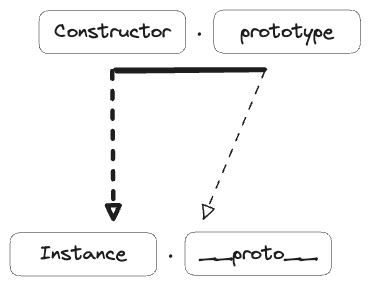
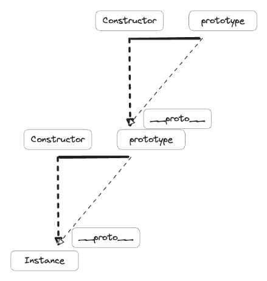

- [프로토타입의 개념](#프로토타입의-개념)
  - [Constructor, prototype, instance](#constructor-prototype-instance)
  - [constructor 프로퍼티](#constructor-프로퍼티)
- [프로토타입 체인](#프로토타입-체인)
- [필요한 추가 학습](#필요한-추가-학습)

## 프로토타입의 개념

### Constructor, prototype, instance

<br>

```js
var instance = mew Constructor();
```

- 생성자 함수를 `new` 연산자와 함께 호출하면 `Constructor`에서 정의된 내용을 바탕으로 새로운 인스턴스가 생성
- 이때 instance에는 `__proto__`라는 프로퍼티가 자동으로 부여되고, 이 프로퍼티는 `Constructor`의 prototype 프로퍼티를 참조한다.
- `__proto__`는 생략 가능한 속성이어서, 인스턴스는 `Constructor.prototype`의 메서드를 자신의 메서드인 것처럼 호출할 수 있다.

### constructor 프로퍼티

- `Constructor.prototype`에는 `constructor`라는 프로퍼티가 있고, 이는 생성자 함수 자신을 가리킨다.
- 이 프로퍼티는 인스턴스가 자신의 생성자 함수가 무엇인지를 알고자할 때 필요하다.

```md
// 다음은 모두 동일한 대상을 가리킨다.
`[Constructor]`
`[instance].__proto__constructor`;
`[instance].constructor`;
`Object.getPrototypeOf([instance]).constructor`
`[Constructor].prototype.constructor`
```

## 프로토타입 체인

<br>

- `__proto__` 프로퍼티 내부에서 다시 `__proto__` 프로퍼티가 연쇄적으로 이어진 것이 **프로토타입 체인**이다.
- 프로토타입 체인을 따라가며 원하는 프로퍼티를 찾는 과정을 **프로토타입 메서드**라고 한다.
- 프로토타입 체이닝을 통해 각 프로토타입 메서드를 자신의 것처럼 호출할 수 있다.
- 접근방식은 시작점으로부터 가장 가까운 대상부터 먼 대상으로 나아가며, 원하는 값을 찾으면 탐색을 중단한다.
- `Object.prototype`에는 모든 데이터타입에서 사용할 수 있는 범용적인 메서드가 존재한다.
- 객체 전용 메서드는 Object 생성자 함수에 `스태틱 메서드`로 설정되어 있다.

## 필요한 추가 학습
