- [📓 Lighthouse CI 자동화 환경 구축 계기](#lighthouse-ci-자동화-환경-구축-계기)
- [📓 Lighthouse](#lighthouse)
- [📓 Lighthouse CI](#-lighthouse-ci)
- [📓 Lighthouse 주요 지표](#lighthouse-주요-지표)
  - [💡 성능(Performance)](#성능performance)
- [📓 Lighthouse 환경 구성 시 사용한 Tool](#lighthouse-환경-구성-시-사용한-tool)
  - [Github Actions](#github-actions)
  - [Octokit](#octokit)
- [🎬 Lighthouse 자동화 환경 구축](#lighthouse-자동화-환경-구축)
  - [1. Lighthouse CI Github App 설치 후, Action Secrets 설정](#1-lighthouse-ci-github-app-설치-후-action-secrets-설정)
  - [2. Lighthouse CI에 사용되는 상수 정의](#2-lighthouse-ci에-사용되는-상수-정의)
  - [3. Lighthouse Configuration 설정](#3-lighthouse-configuration-설정)
  - [4. Lighthouse Workflow 작성](#4-lighthouse-workflow-작성)
    - [💡 Setup 설정](#-setup-설정)
    - [💡Lighthouse CI를 활용한 성능 테스트를 위한 환경 설정](#lighthouse-ci를-활용한-성능-테스트를-위한-환경-설정)
    - [💡 Lighthouse CI 실행 및 Report 생성](#-lighthouse-ci-실행-및-report-생성)
    - [💡 주요 지표 포매팅](#-주요-지표-포매팅)
    - [💡 PR Comment 반영](#-pr-comment-반영)
  - [📄 결과](#결과)
    - [💡 반영된 PR Comment](#반영된-pr-comment)
    - [💡 페이지별 주요 지표](#페이지별-주요-지표)
  - [🤔 Lighthouse CI를 활용한 자동화 환경 구축 소감](#-lighthouse-ci를-활용한-자동화-환경-구축-소감)
- [📓 References](#references)

[✔︎ Lighthouse 자동화 환경 구축 관련 PR](https://github.com/Ludo-SMP/ludo-frontend/pull/349)

Lighthouse 자동화 환경 구축을 진행한 경험을 작성한 글입니다.

## 📓 Lighthouse CI 자동화 환경 구축 계기

앞선 2차례의 마일스톤에서는 주요 기능 구현에 집중을 하여 프론트엔드 성능 최적화는 자연스레 후순위로 밀리게 되었습니다. 그리하여 3차 마일스톤에서는 프론트엔드 성능 개선을 목표로 설정하고, Lighthouse를 활용한 성능 개선 작업을 진행하였습니다.

성능 개선 과정 중에 수정된 코드를 반영한 후 개발자 도구의 Lighthouse를 실행시켜 성능 지표를 확인하는 과정을 반복하게 되었습니다. 그리하여 이러한 반복적인 작업을 자동화할 필요성을 느끼게 되었고, Lighthouse CI를 적용하여 이를 자동화하는 환경을 구축하게 되었습니다.

## 📓 Lighthouse

Lighthouse Github 저장소에서는 Lighthouse를 다음과 같이 설명하고 있습니다.

> Lighthouse analyzes web apps and web pages, collecting modern performance metrics and insights on developer best practices.

_Lighthouse는 웹 앱과 웹 페이지를 분석하여 개발자 모범 사례에 대한 최신 성능지표와 인사이트를 수집합니다._

또한 Lighthouse Chrome 공식문서에서는 Lighthouse의 기능을 다음과 같이 설명하고 있습니다.

> [Lighthouse](https://github.com/GoogleChrome/lighthouse) is an open-source, automated tool for improving the quality of web pages. It has audits for performance, accessibility, progressive web apps, SEO, and more.

_Lighouse는 웹페이지 품질을 개선하기 위한 오픈소스 자동화 도구입니다. 성능, 접근성, 프로그레시브 웹 앱, 검색엔진 최적화 등에 대한 감사(audit)가 제공됩니다._

이를 정리하면 Lighthouse는 웹 앱 및 웹 페이지를 분석하여 성능지표, 접근성, PWA, SEO 등의 항목에 대한 audit 결과를 점수로 제공하고, 각 항목을 개선하기 위한 인사이트를 제공하는 오픈소스 자동화 도구입니다.

## 📓 Lighthouse CI

**Lighthouse CI**는 Google의 **Lighthouse** 도구를 CI/CD 파이프라인에서 자동으로 실행하고 결과를 저장 및 관리할 수 있게 해주는 오픈 소스 도구입니다. 따라서 Lighthouse CI를 통해 웹 페이지의 성능을 지속적으로 측정하고, 이를 GitHub Actions와 연동하여 PR(Pull Request)에 자동으로 피드백을 반영할 수 있게 되고, 이를 통해 페이지의 품질을 자동으로 모니터링하고 코드 변경 사항에 대한 지속적인 품질 관리를 할 수 있게 됩니다.

## 📓 Lighthouse 주요 지표

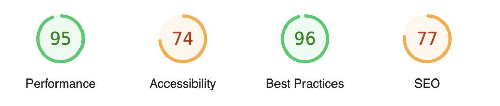
특정 페이지에서 Lighthouse를 실행하면 위와 같이 여러 지표들에 대한 점수가 제공됩니다.

### 💡 성능(Performance)

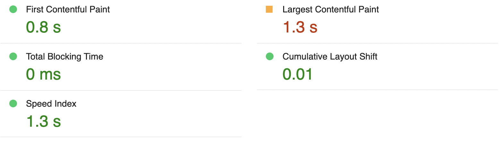

성능 지표는 웹 앱 및 웹 페이지의 성능을 나타내는 지표로 세부 성능 항목을 기반으로 점수가 계산이 됩니다. 주요 세부 성능 항목은 다음과 같습니다.

1. **FCP(First Contentful Paint)**

   페이지 로드가 시작된 시점부터 페이지 콘텐츠의 일부가 화면에 렌더링되기 시작하는 시점까지의 시간을 측정하는 항목입니다.

2. **LCP(Largest Contentful Paint)**

   페이지 로드가 시작된 시점부터 뷰포트에서 가장 큰 콘텐츠 요소가 화면에 렌더링되는 시점까지의 시간을 측정하는 항목입니다.

3. **TBT(Total Blocking Time)**

   FCP와 TTI 사이에서 기본 스레드가 일정 시간 이상으로 입력에 대한 응답을 방지한 시간을 측정하는 항목입니다.

   - TTI(Time To Interactive) : 페이지가 완전히 상호작용이 가능하게 되기까지 소요된 시간입니다.

4. **CLS(Cumulative Layout Shift)**

   예상치 못한 레이아웃의 이동/변경의 누적 점수를 측정하는 항목입니다.

5. **Speed Index**

   페이지 로드 중 콘텐츠가 시각적으로 표시되는 속도를 측정하는 항목입니다.

## 📓 Lighthouse 환경 구성 시 사용한 Tool

### Github Actions

GitHub Actions는 GitHub에서 제공하는 CI/CD(지속적인 통합/지속적인 배포) 도구로, 코드가 변경될 때마다 자동화된 워크플로를 실행할 수 있게 해줍니다. 이를 통해 빌드, 테스트, 배포 등의 작업을 자동화할 수 있습니다.

### Octokit

**Octokit**은 GitHub API와 상호작용하기 위해 GitHub에서 제공하는 공식 라이브러리로써, GitHub API를 더 직관적이고 간편하게 사용할 수 있도록 도와줍니다. 이를 통해 GitHub의 기능을 코드 내에서 자동화하거나 다른 시스템과 통합하는 데 유용합니다.

## 🎬 Lighthouse 자동화 환경 구축

### 1. Lighthouse CI Github App 설치 후, Action Secrets 설정

Lighthouse CI와 Github Actions을 연동하기 위해, Lighthouse CI Github App을 Repository에 설치한 후, 생성된 Token을 Action Secrets으로 설정하는 과정이 선행하였습니다.

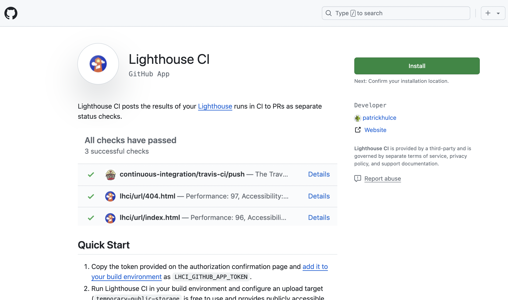

먼저, Github 마켓 플레이스에서 Lighthouse CI App을 설치해줍니다.

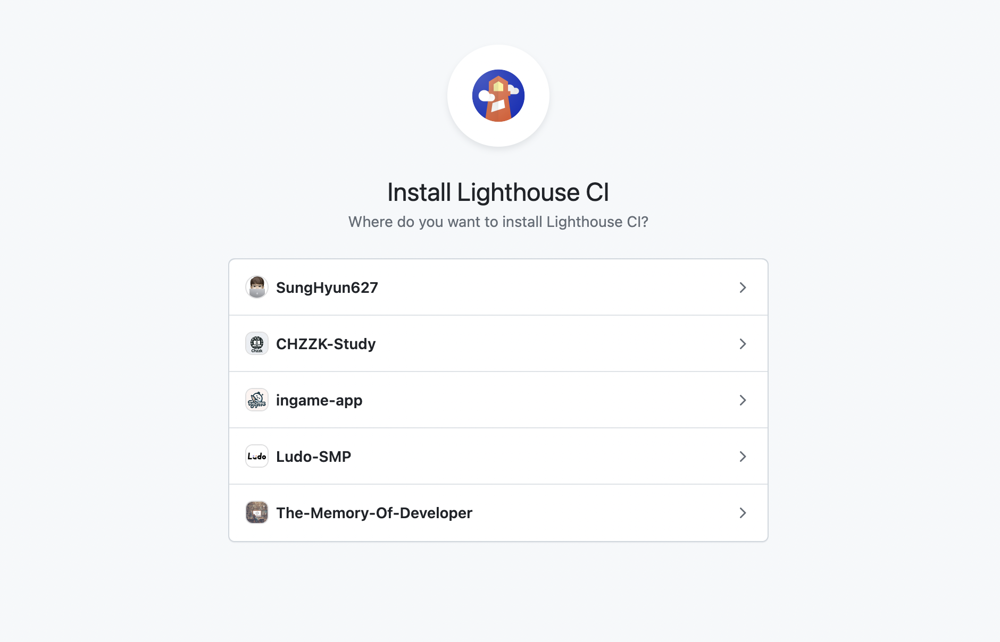

Install 버튼을 누르면 Lighthouse CI를 설치할 Organization을 선택할 수 있습니다. 저는 Ludo 프로젝트를 관리하고 있는 Ludo-SMP Organization을 선택하였습니다.

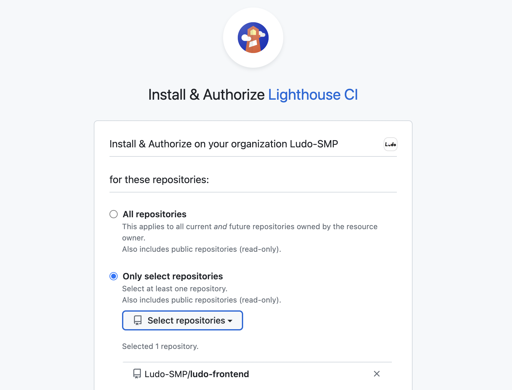

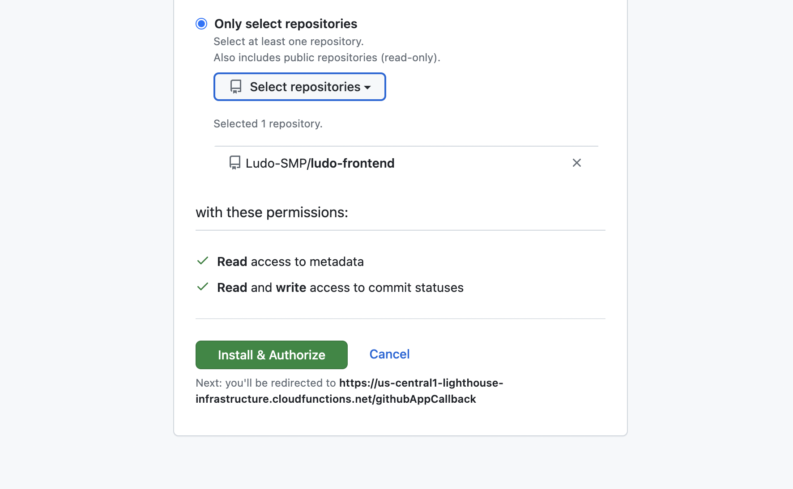

모든 저장소에 Lighthouse CI를 설치할 것인지, 개별 저장소에 설치할 것인지를 선택합니다. Frontend 저장소에만 Lighthouse CI를 적용시키기 위해 ludo-frontend 저장소를 선택하였습니다.

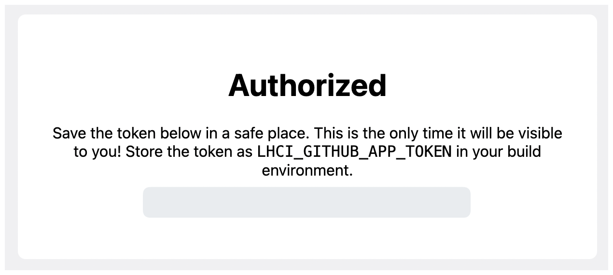

다음과 같이 회색 영역에 생성된 Token이 표시가 됩니다.

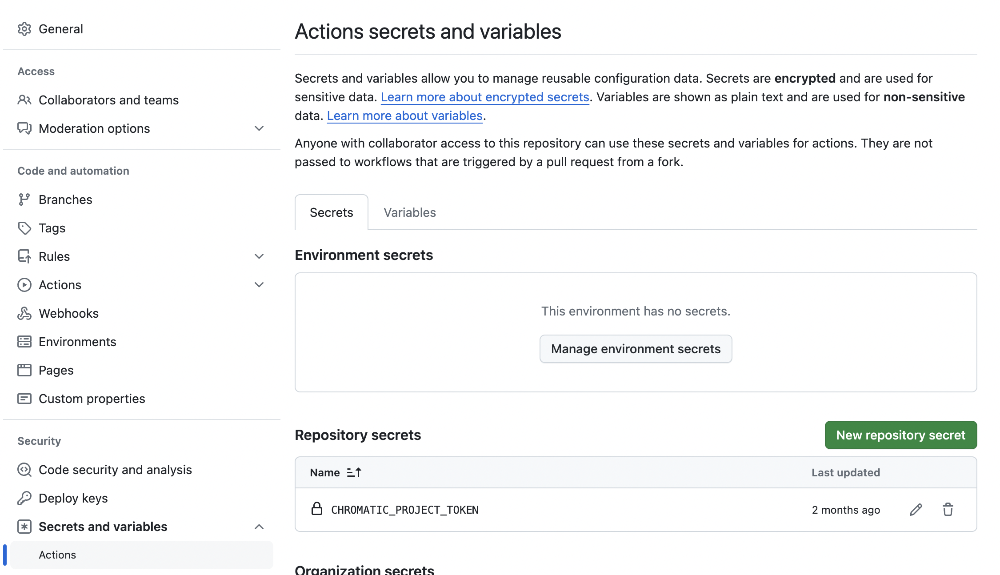

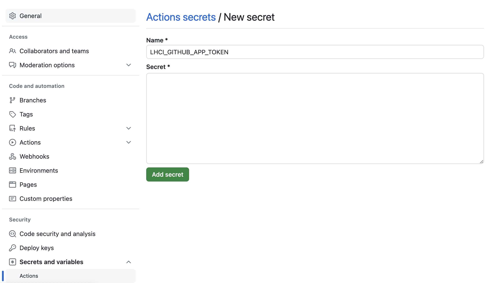

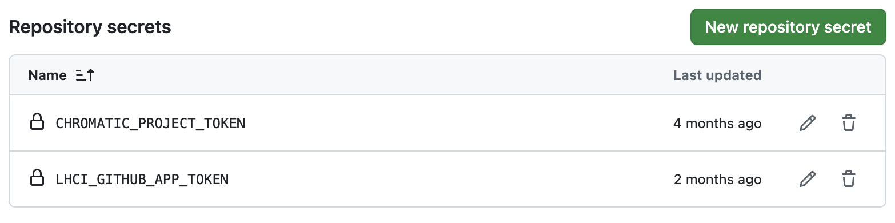

Lighthouse CI를 적용할 저장소의 Settings - Secrets and variables - Actions - New repository secret을 클릭하여 Name을 LHCI_GITHUB_APP_TOKEN으로 설정하고, 이전 단계에서 생성된 Token 값을 Secret에 적용하여 Action Secret을 설정해줍니다.

### 2. Lighthouse CI에 사용되는 상수 정의

Lighthouse CI를 설정하는 데 필요한 상수를 정의했습니다.

```ts
// src/Constants/lighthouse.ts

const TEST_RECRUITMENT_ID = 70;
const LH_GREEN_MIN_SCORE = 90;
const LH_ORANGE_MIN_SCORE = 50;

const PAGE_ROUTES = {
  MAIN: '/',
  AUTH: {
    LOGIN: '/login',
  },
  RECRUITMENT: {
    RECRUITMENTS: '/studies',
    DETAIL: `/studies/${TEST_RECRUITMENT_ID}/recruitment`,
  },
};

module.exports = {
  DEV_ORIGIN_URL: `https://local.ludo.study:3000`,
  LH_MONITORING_PAGE_NAMES: ['메인', '로그인', '모집공고 모아보기', '모집공고 상세'],
  LH_MIN_SCORES: { GREEN: LH_GREEN_MIN_SCORE, ORANGE: LH_ORANGE_MIN_SCORE },
  LH_MONITORING_PAGE_ROUTES: {
    메인: PAGE_ROUTES.MAIN,
    로그인: PAGE_ROUTES.AUTH.LOGIN,
    '모집공고 모아보기': PAGE_ROUTES.RECRUITMENT.RECRUITMENTS,
    '모집공고 상세': PAGE_ROUTES.RECRUITMENT.DETAIL,
  },
};
```

- TEST_RECRUITMENT_ID : 특정 모집공고의 ID를 나타내는 상수
- LH_GREEN_MIN_SCORE : 웹 페이지가 "양호" 성능을 갖기 위해 필요한 최소 Lighthouse 성능 점수
- LH_ORANGE_MIN_SCORE : 웹 페이지가 "보통" 성능을 갖기 위해 필요한 최소 Lighthouse 성능 점수
- PAGE_ROUTES : Lighthouse 테스트를 적용할 애플리케이션 내의 주요 페이지 경로를 정의하는 객체
- DEV_ORIGIN_URL : 개발 환경에서 사용되는 기본 URL
- LH_MONITORING_PAGE_NAMES : Lighthouse CI에서 모니터링할 페이지 이름들의 배열

### 3. Lighthouse Configuration 설정

mobile 환경과 desktop 환경을 구분하여 Lighthouse Configuration을 설정했습니다.

```jsx
// lighthouserc-mobile.cjs
const {
  LH_MONITORING_PAGE_NAMES,
  DEV_ORIGIN_URL,
  LH_MONITORING_PAGE_ROUTES,
} = require('./src/Constants/lighthouse.ts');

const urls = LH_MONITORING_PAGE_NAMES.map(
  (pageName) => `${DEV_ORIGIN_URL}${LH_MONITORING_PAGE_ROUTES[pageName]}`
);

module.exports = {
  ci: {
    collect: {
      startServerCommand: 'yarn start:mac',
      url: urls,
      numberOfRuns: 1,
      settings: {
        chromeFlags: '--ignore-certificate-errors',
      },
    },
    upload: {
      target: 'filesystem',
      outputDir: './lhci_reports/mobile',
      reportFilenamePattern: '%%PATHNAME%%-%%DATETIME%%-mobile-report.%%EXTENSION%%',
    },
  },
};
```

```jsx
// lighthouserc-desktop.cjs
const {
  LH_MONITORING_PAGE_NAMES,
  DEV_ORIGIN_URL,
  LH_MONITORING_PAGE_ROUTES,
} = require('./src/Constants/lighthouse.ts');

const urls = LH_MONITORING_PAGE_NAMES.map(
  (pageName) => `${DEV_ORIGIN_URL}${LH_MONITORING_PAGE_ROUTES[pageName]}`
);

module.exports = {
  ci: {
    collect: {
      startServerCommand: 'yarn start:mac',
      url: urls,
      numberOfRuns: 1,
      settings: {
        chromeFlags: '--ignore-certificate-errors',
      },
    },
    upload: {
      target: 'filesystem',
      outputDir: './lhci_reports/mobile',
      reportFilenamePattern: '%%PATHNAME%%-%%DATETIME%%-mobile-report.%%EXTENSION%%',
    },
  },
};
```

### 4. Lighthouse Workflow 작성

설정한 Lighthouse 상수 및 Configuration을 기반으로 Lighthouse Worflow를 작성했습니다.

#### 💡 Setup 설정

GitHub Actions Workflow의 환경을 설정했습니다.

```yaml
name: Run lighthouse CI When Push on PR to Dev Branch
on:
  pull_request:
    branches:
      - dev
    types: [synchronize, opened]

permissions:
  contents: read
  pull-requests: write
```

- **`name`**: 워크플로우의 이름을 설정. PR이 `dev` 브랜치로 푸시될 때 Lighthouse CI를 실행한다고 명시했습니다.
- **`on.pull_request`**: 이 워크플로우가 PR이 `dev` 브랜치에 대해 `synchronize` 또는 `opened` 될 때 트리거되도록 설정됩니다.
- **`permissions`**: `contents: read`와 `pull-requests: write` 권한을 설정하여, PR에 대한 읽기/쓰기 권한을 부여합니다.

#### 💡Lighthouse CI를 활용한 성능 테스트를 위한 환경 설정

**Lighthouse CI**를 활용한 성능 테스트를 진행할 수 있도록 필요한 환경을 설정했습니다. 이를 통해 코드를 체크아웃하고, Node.js 환경을 설정하며, 의존성을 설치하고, 로컬 서버를 설정한 후, 프로젝트를 빌드하여 테스트가 실행될 환경을 준비합니다.

```yaml
jobs:
  lhci:
    name: Lighthouse CI
    runs-on: ubuntu-latest
    steps:
      # 1. Checkout 코드
      - name: Checkout
        uses: actions/checkout@v4

      # 2. Node.js 설정
      - name: Use Node.js 20.10.0
        uses: actions/setup-node@v4
        with:
          node-version-file: .node-version

      # 3. 의존성 설치
      - name: Install dependencies
        run: |
          yarn install --immutable --immutable-cache --check-cache

      # 4. 호스트 파일 수정
      - name: Add host "local.ludo.study"
        run: sudo echo "127.0.0.1 local.ludo.study" | sudo tee -a /etc/hosts

      # 5. 프로젝트 빌드
      - name: Build the project
        run: |
          yarn build
```

#### 💡 Lighthouse CI 실행 및 Report 생성

Mobile과 Desktop 환경별로 설정된 configuration 파일을 기반으로 Lighthouse CI를 실행하여, Report를 생성합니다.

```yaml
# 6. Desktop Lighthouse CI 실행
- name: Run Lighthouse CI - Desktop
  env:
    LHCI_GITHUB_APP_TOKEN: ${{ secrets.LHCI_GITHUB_APP_TOKEN }}
  run: |
    yarn global add @lhci/cli
    lhci collect --config=lighthouserc-desktop.cjs || echo "Fail to Run Lighthouse CI!"
    lhci upload --config=lighthouserc-desktop.cjs || echo "Fail to Run Lighthouse CI!"

# 7. Mobile Lighthouse CI 실행
- name: Run Lighthouse CI - Mobile
  env:
    LHCI_GITHUB_APP_TOKEN: ${{ secrets.LHCI_GITHUB_APP_TOKEN }}
  run: |
    lhci collect --config=lighthouserc-mobile.cjs || echo "Fail to Run Lighthouse CI!"
    lhci upload --config=lighthouserc-mobile.cjs || echo "Fail to Run Lighthouse CI!"
```

#### 💡 주요 지표 포매팅

**GitHub Script** 액션을 사용하여 Lighthouse 결과를 읽고, 성능 지표를 **포맷팅**합니다. 해당 스크립트를 통해 `lhci_reports` 디렉토리에 저장된 데스크탑 및 모바일 보고서를 읽고, 성능 지표(성능, 접근성, SEO 등)를 추출합니다. 또한 각 페이지별로 점수를 **표 형식**으로 포맷팅하고, PR에 추가할 수 있도록 **Markdown 형식**으로 생성합니다.

```yaml
- name: Format Lighthouse Score
  id: format_lighthouse_score
  uses: actions/github-script@v7
  env:
    working-directory: ${{ github.workspace }}
  with:
    github-token: ${{ secrets.GITHUB_TOKEN }}
    script: |
      const fs = require('fs');

      const {
        LH_MONITORING_PAGE_NAMES,
        DEV_ORIGIN_URL,
        LH_MONITORING_PAGE_ROUTES,
        LH_MIN_SCORES,
      } = require('./src/Constants/lighthouse.ts');

      const desktopLightHouseResults = JSON.parse(fs.readFileSync('lhci_reports/desktop/manifest.json'));
      const mobileLightHouseResults = JSON.parse(fs.readFileSync('lhci_reports/mobile/manifest.json'));

      let comments = `### 💡 LightHouse Reports\n\n`;
      comments += `#### 🟢 90 ~ 100 &nbsp;&nbsp; 🟠 50 ~ 89 &nbsp;&nbsp; 🔴 0 ~ 49 \n\n`;

      const getFormattingScore = (res) => Math.round(res * 100);

      const getScoreColor = (score) => (score >= LH_MIN_SCORES.GREEN ? '🟢' : score >= LH_MIN_SCORES.ORANGE ? '🟠' : '🔴');

      const getMonitoringPageName = (url) => {
        const route = url.replace(DEV_ORIGIN_URL, '');

        for (let pageName of LH_MONITORING_PAGE_NAMES) {
          if (route === LH_MONITORING_PAGE_ROUTES[pageName]) return pageName;
        }
      };

      const getFormattingResultByPage = (result) => {
        const { url, summary, jsonPath } = result;
        const { audits } = JSON.parse(fs.readFileSync(jsonPath));

        const { performance, accessibility, 'best-practices': bestPractices, seo } = summary;

        const {
          'first-contentful-paint': firstContentfulPaint,
          'largest-contentful-paint': largestContentfulPaint,
          'speed-index': speedIndex,
          'total-blocking-time': totalBlockingTime,
          'cumulative-layout-shift': cumulativeLayoutShift,
        } = audits;

        const formattingTable = [
          `| Category | Score |`,
          `| --- | --- |`,
          `| ${getScoreColor(getFormattingScore(performance))} Performance | ${getFormattingScore(performance)} |`,
          `| ${getScoreColor(getFormattingScore(accessibility))} Accessibility | ${getFormattingScore(accessibility)} |`,
          `| ${getScoreColor(getFormattingScore(bestPractices))} Best practices | ${getFormattingScore(bestPractices)} |`,
          `| ${getScoreColor(getFormattingScore(seo))} SEO | ${getFormattingScore(seo)} |`,
          `| ${getScoreColor(getFormattingScore(firstContentfulPaint.score))} First Contentful Paint | ${firstContentfulPaint.displayValue} |`,
          `| ${getScoreColor(getFormattingScore(largestContentfulPaint.score))} Largest Contentful Paint | ${largestContentfulPaint.displayValue} |`,
          `| ${getScoreColor(getFormattingScore(speedIndex.score))} Speed Index | ${speedIndex.displayValue} |`,
          `| ${getScoreColor(getFormattingScore(totalBlockingTime.score))} Total Blocking Time | ${totalBlockingTime.displayValue} |`,
          `| ${getScoreColor(getFormattingScore(cumulativeLayoutShift.score))} Cumulative Layout Shift | ${cumulativeLayoutShift.displayValue} |`,
          `\n`,
        ].join('\n');

        return `<details>\n<summary>${`📄 ${getMonitoringPageName(url)}\n`}</summary>\n\n${formattingTable}\n</details>\n\n`;
      };

      const getLightHouseFormattingResult = (results, type) => {
        let comment = type === 'mobile' ? `#### 📱 Mobile\n` : `#### 🖥  Desktop\n`;
        results.forEach((result) => (comment += getFormattingResultByPage(result)));

        return comment + '\n';
      };

      comments += getLightHouseFormattingResult(desktopLightHouseResults, 'desktop');
      comments += getLightHouseFormattingResult(mobileLightHouseResults, 'mobile');

      core.setOutput('comments', comments)
```

#### 💡 PR Comment 반영

`Octokit`을 사용해 현재 PR에 기존 코멘트를 찾아 업데이트하거나, 새로운 코멘트를 추가합니다. `format_lighthouse_score` 단계에서 포맷팅한 Lighthouse 보고서를 PR에 코멘트로 추가합니다. 만약 이전에 Lighthouse 보고서가 있었다면 이를 업데이트하고, 없다면 새로 생성합니다.

```yaml
- name: Comment PR
        id: add_pr_comment
        uses: actions/github-script@v7
        with:
          github-token: ${{ secrets.GITHUB_TOKEN }}
          script: |
            const { Octokit } = require('@octokit/rest');
            const octokit = new Octokit({ auth: `${{ secrets.GITHUB_TOKEN }}` });

            const { payload, repo } = context

            const newComment = `${{ steps.format_lighthouse_score.outputs.comments }}`

            const { data: prevComments } = await octokit.rest.issues.listComments({
              owner: repo.owner,
              repo: repo.repo,
              issue_number : payload.pull_request.number,
            })

            const prevReportComment = prevComments.find(comment => comment.body.includes(`### 💡 LightHouse Reports\n\n`));

            if (prevReportComment) {
                await octokit.rest.issues.updateComment({
                  owner: repo.owner,
                  repo: repo.repo,
                  comment_id: prevReportComment.id,
                  body: newComment,
              });
            } else {
                await octokit.rest.issues.createComment({
                owner: repo.owner,
                repo: repo.repo,
                issue_number: payload.pull_request.number,
                body: newComment,
              });
            }
```

### 📄 결과

#### 💡 반영된 PR Comment

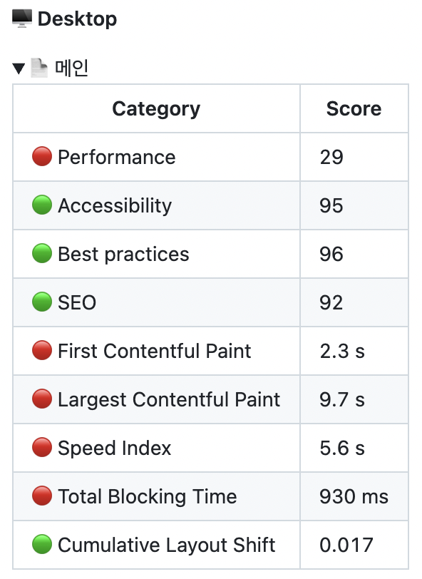

#### 💡 페이지별 주요 지표

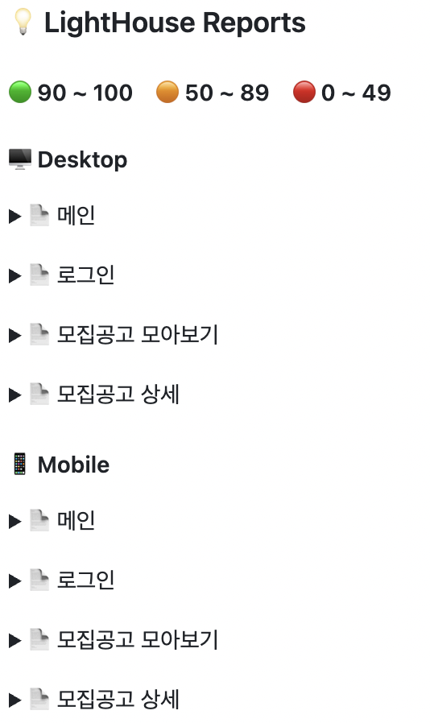

### 🤔 Lighthouse CI를 활용한 자동화 환경 구축 소감

Lighthouse CI를 활용한 성능 측정 자동화 환경 구축 과정을 통해, 여러 중요한 기술을 익힐 수 있었습니다. GitHub Actions를 이용해 PR 생성 시 자동으로 Lighthouse 성능을 측정하고, 결과를 실시간으로 공유할 수 있게 되었습니다.
Lighthouse CI를 설정하여 성능, 접근성, SEO, 베스트 프랙티스를 자동으로 점검하고, Octokit을 활용해 GitHub API와 연동하여 PR에 성능 보고서를 자동으로 PR Comment로 남길 수 있었습니다. 이러한 자동화된 성능 측정 시스템을 구축을 통해 성능 문제를 조기에 식별하고 대응할 수 있는 환경을 마련하게 되었고, 팀의 개발 효율성을 높이는 데 기여할 수 있었습니다.
그러나 개발 서버와 배포 서버 간의 성능 차이가 발생하는 문제는 아쉬운 점으로 남았습니다. 개발 서버에서는 최적화가 덜 되어 있고, 로컬 환경에서의 성능 측정이 배포 환경과 다를 수 있기 때문입니다. 이를 해결하기 위해서는 배포 환경과 개발 환경을 최대한 유사하게 맞추거나, 두 환경에서 각각 성능을 측정하는 방법을 고려해야 할 필요가 있습니다. 이와 같은 문제점을 해결함으로써 성능 측정의 정확성을 높이고, 자동화된 성능 테스트 시스템을 더욱 효과적으로 활용할 수 있을 것입니다.

## 📓 References

- [Lighthouse 개요](https://developer.chrome.com/docs/lighthouse/overview?hl=ko)
- [Lighthouse](https://github.com/GoogleChrome/lighthouse)
- [Lighthouse CI](https://github.com/GoogleChrome/lighthouse-ci)
- [Lighthouse CI를 알아보고 Github Actions에 적용하기](https://fe-developers.kakaoent.com/2022/220602-lighthouse-with-github-actions/)
- [Lighthouse CI 적용](https://velog.io/@bae-sh/Lighthouse-CI-%EC%A0%81%EC%9A%A9#lighthousercjs)
- [octokit/rest.js](https://octokit.github.io/rest.js/v21/#issues-get-comment)
- [쌈@뽕하게 Lighthouse 자동화하기](https://velog.io/@greencloud/%EC%8C%88%EB%BD%95%ED%95%98%EA%B2%8C-Lighthouse-%EC%9E%90%EB%8F%99%ED%99%94%ED%95%98%EA%B8%B0-ijcqk0uv#-lighthouseyml)
- [GitHub Actions용 빠른 시작](https://docs.github.com/ko/actions/writing-workflows/quickstart)
- [Lighthouse 사용법](https://velog.io/@dell_mond/Lighthouse-%EC%82%AC%EC%9A%A9%EB%B2%95)
- [Lighthouse CI Configuration](https://github.com/GoogleChrome/lighthouse-ci/blob/main/docs/configuration.md)
- [지속적 통합이란 무엇입니까?](https://aws.amazon.com/ko/devops/continuous-integration/)
- [CI/CD 란](https://velog.io/@leejungho9/CICD-%EB%9E%80#%EC%A7%80%EC%86%8D%EC%A0%81-%ED%86%B5%ED%95%A9continuous-integration-ci)
- [lighthouse-ci-docs-getting-started](https://github.com/GoogleChrome/lighthouse-ci/blob/main/docs/getting-started.md#getting-started)
- [Github Actions 이해](https://docs.github.com/ko/actions/about-github-actions/understanding-github-actions)
