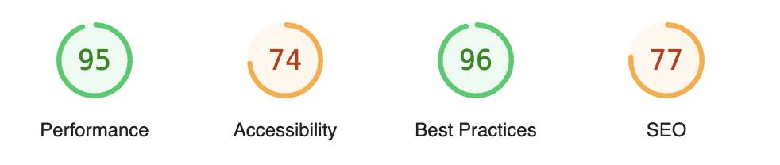

- [📓 Lighthouse CI 자동화 환경 구축 계기](#lighthouse-ci-자동화-환경-구축-계기)
- [📓 Lighthouse란](#lighthouse란)
- [📓 Lighthouse 주요 지표](#lighthouse-주요-지표)
  - [**💡 성능(Performance)**](#성능performance)
  - [**💡 접근성(Accessibility), 모범사례(Best Practices), 검색 엔진 최적화(SEO)**](#접근성accessibility-모범사례best-practices-검색-엔진-최적화seo)
- [📓 Lighthouse CI 자동화 환경 구축 시 사용된 Tool](#lighthouse-ci-자동화-환경-구축-시-사용된-tool)
  - [1. Lighthouse CI](#1-lighthouse-ci)
  - [2. Github Actions](#2-github-actions)
  - [3. Octokit/test.js](#3-octokittestjs)
- [🎬 Lighthouse 자동화 환경 구성 Steps](#lighthouse-자동화-환경-구성-steps)
  - [1. Lighthouse CI Configuration 설정](#1-lighthouse-ci-configuration-설정)
  - [2. Lighthouse CI에 사용되는 상수 정의](#2-lighthouse-ci에-사용되는-상수-정의)
  - [3. Workflow 작성 - 환경 설정](#3-workflow-작성---환경-설정)
  - [4. Workflow 작성 - Lighthouse CI 실행 및 Report 생성](#4-workflow-작성---lighthouse-ci-실행-및-report-생성)
  - [5. Workflow 작성 - 주요 지표 포매팅](#5-workflow-작성---주요-지표-포매팅)
  - [6. Workflow 작성 - PR Comment 반영](#6-workflow-작성---pr-comment-반영)
- [📄 결과](#결과)
  - [💡 반영된 PR Comment](#반영된-pr-comment)
  - [💡 페이지별 주요 지표](#페이지별-주요-지표)
  - 
  - [Github Actions](#github-actions)
  - [소감](#소감)
- [📓 References](#references)

[✔︎ Lighthouse 자동화 환경 구축 관련 PR](https://github.com/Ludo-SMP/ludo-frontend/pull/349)

## 📓 Lighthouse CI 자동화 환경 구축 계기

앞선 2차례의 마일스톤에서는 주요 기능 구현에 집중을 하여 프론트엔드 성능 최적화는 자연스레 후순위로 밀리게 되었습니다. 그리하여 3차 마일스톤에서는 프론트엔드 성능 개선을 목표로 설정하고, Lighthouse를 활용한 성능 개선 작업을 진행하였습니다.

성능 개선 과정 중에 수정된 코드를 반영한 후 개발자 도구의 Lighthouse를 실행시켜 성능 지표를 확인하는 과정을 반복하게 되었습니다. 그리하여 이러한 반복적인 작업을 자동화할 필요성을 느끼게 되었고, Lighthouse CI를 적용하여 이를 자동화하는 환경을 구축하게 되었습니다.

## 📓 Lighthouse란

Lighthouse Github 저장소에서는 Lighthouse를 다음과 같이 설명하고 있습니다.

> Lighthouse analyzes web apps and web pages, collecting modern performance metrics and insights on developer best practices.

_Lighthouse는 웹 앱과 웹 페이지를 분석하여 개발자 모범 사례에 대한 최신 성능지표와 인사이트를 수집합니다._

>

또한 Lighthouse Chrome 공식문서에서는 Lighthouse의 기능을 다음과 같이 설명하고 있습니다.

> [Lighthouse](https://github.com/GoogleChrome/lighthouse) is an open-source, automated tool for improving the quality of web pages. It has audits for performance, accessibility, progressive web apps, SEO, and more.

_Lighouse는 웹페이지 품질을 개선하기 위한 오픈소스 자동화 도구입니다. 성능, 접근성, 프로그레시브 웹 앱, 검색엔진 최적화 등에 대한 감사(audit)가 제공됩니다._

>

이를 정리하면 Lighthouse는 웹 앱 및 웹 페이지를 분석하여 성능지표, 접근성, PWA, SEO 등의 항목에 대한 audit 결과를 점수로 제공하고, 각 항목을 개선하기 위한 인사이트를 제공하는 오픈소스 자동화 도구입니다.

그렇다면 Lighthouse에서 제공하면 주요 지표는 어떤 것이 있는지 살펴보겠습니다.

## 📓 Lighthouse 주요 지표

특정 페이지에서 Lighthouse를 실행하면 위와 같이 여러 지표들에 대한 점수가 제공됩니다.

### **💡 성능(Performance)**

성능 지표는 웹 앱 및 웹 페이지의 성능을 나타내는 지표로 세부 성능 항목을 기반으로 점수가 계산이 됩니다. 주요 세부 성능 항목은 다음과 같습니다.

1. **FCP(First Contentful Paint)**

   페이지 로드가 시작된 시점부터 페이지 콘텐츠의 일부가 화면에 렌더링되기 시작하는 시점까지의 시간을 측정하는 항목입니다.

2. **LCP(Largest Contentful Paint)**

   페이지 로드가 시작된 시점부터 뷰포트에서 가장 큰 콘텐츠 요소가 화면에 렌더링되는 시점까지의 시간을 측정하는 항목입니다.

3. **TBT(Total Blocking Time)**

   FCP와 TTI 사이에서 기본 스레드가 일정 시간 이상으로 입력에 대한 응답을 방지한 시간을 측정하는 항목입니다.

   - TTI(Time To Interactive) : 페이지가 완전히 상호작용이 가능하게 되기까지 소요된 시간입니다.

4. **CLS(Cumulative Layout Shift)**

   예상치 못한 레이아웃의 이동/변경의 누적 점수를 측정하는 항목입니다.

5. **Speed Index**

   페이지 로드 중 콘텐츠가 시각적으로 표시되는 속도를 측정하는 항목입니다.

### **💡 접근성(Accessibility), 모범사례(Best Practices), 검색 엔진 최적화(SEO)**

- **접근성(Accessibility)**

다양한 환경의 사용자들이 웹 페이지를 이용할 수 있도록 하기 위한 웹 접근성 규칙을 준수했는 지를 수치화한 지표입니다.

- **모범사례(Best Practices)**

웹 표준 모범 사례를 준수하고 있는지를 나타내는 지표입니다.

- **검색 엔진 최적화(SEO)**

해당 웹페이지가 검색 엔진 결과에서 더 높은 순위를 얻기 위해 어떻게 최적화되어 있는지를 평가하는 지표입니다.

이러한 Lighthouse를 통해 얻을 수 있는 지표를 특정 브랜치의 PR에 코드를 Push 했을 때 Comment에 반영이 되도록 구현하고 싶었고, 이를 Lighthouse CI를 통해 Github Action과 연동하여 이를 수행할 수 있었습니다.

## 📓 Lighthouse CI 자동화 환경 구축 시 사용된 Tool

### 1. Lighthouse CI

### 2. Github Actions

### 3. Octokit/test.js

## 🎬 Lighthouse 자동화 환경 구성 Steps

### 1. Lighthouse CI Configuration 설정

### 2. Lighthouse CI에 사용되는 상수 정의

### 3. Workflow 작성 - 환경 설정

### 4. Workflow 작성 - Lighthouse CI 실행 및 Report 생성

### 5. Workflow 작성 - 주요 지표 포매팅

### 6. Workflow 작성 - PR Comment 반영

## 📄 결과

### 💡 반영된 PR Comment

### 💡 페이지별 주요 지표

###

### Github Actions

### 소감

## 📓 References

- [Lighthouse 개요](https://developer.chrome.com/docs/lighthouse/overview?hl=ko)
- [Lighthouse](https://github.com/GoogleChrome/lighthouse)
- [Lighthouse CI](https://github.com/GoogleChrome/lighthouse-ci)
- [Lighthouse CI를 알아보고 Github Actions에 적용하기](https://fe-developers.kakaoent.com/2022/220602-lighthouse-with-github-actions/)
- [Lighthouse CI 적용](https://velog.io/@bae-sh/Lighthouse-CI-%EC%A0%81%EC%9A%A9#lighthousercjs)
- [octokit/rest.js](https://octokit.github.io/rest.js/v21/#issues-get-comment)
- [쌈@뽕하게 Lighthouse 자동화하기](https://velog.io/@greencloud/%EC%8C%88%EB%BD%95%ED%95%98%EA%B2%8C-Lighthouse-%EC%9E%90%EB%8F%99%ED%99%94%ED%95%98%EA%B8%B0-ijcqk0uv#-lighthouseyml)
- [GitHub Actions용 빠른 시작](https://docs.github.com/ko/actions/writing-workflows/quickstart)
- [Lighthouse 사용법](https://velog.io/@dell_mond/Lighthouse-%EC%82%AC%EC%9A%A9%EB%B2%95)
- [Lighthouse CI Configuration](https://github.com/GoogleChrome/lighthouse-ci/blob/main/docs/configuration.md)
