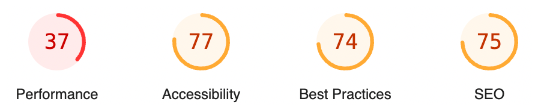

- [📓 Lighthouse를 활용한 성능 개선 배경](#lighthouse를-활용한-성능-개선-배경)
- [📓 Core Web Vitals과 Lighthouse 주요 성능 지표](#core-web-vitals과-lighthouse-주요-성능-지표)
  - [💡Core Web Vitals](#core-web-vitals)
  - [💡Lighthouse 주요 성능 지표](#lighthouse-주요-성능-지표)
- [🔨 성능 저해 요인 분석](#성능-저해-요인-분석)
  - [😈 많은 양의 사용되지 않는 JS 코드](#많은-양의-사용되지-않는-js-코드)
  - [😈 Layout Shift 요소 확인 - 메인페이지 배너](#layout-shift-요소-확인---메인페이지-배너)
  - [😈 LCP 요소의 Loading Delay](#lcp-요소의-loading-delay)
  - [😈 최적화되지 않은 큰 용량의 이미지 파일과 웹 폰트 파일](#최적화되지-않은-큰-용량의-이미지-파일과-웹-폰트-파일)
- [📓 성능 개선 작업](#성능-개선-작업)
  - [💡 Code Splitting 적용](#code-splitting-적용)
  - [💡 웹 폰트 및 이미지 최적화](#웹-폰트-및-이미지-최적화)
- [💡 배너 이미지 및 웹 폰트 Preload](#배너-이미지-및-웹-폰트-preload)
  - [💡 Layout Shift 제거](#layout-shift-제거)
- [📓 개선 결과](#개선-결과)
- [📓 Lighthouse를 활용한 성능 개선 소감](#lighthouse를-활용한-성능-개선-소감)
- [📓 참고자료](#참고자료)

스터디 매칭 플랫폼(Ludo) 프로젝트 막바지에 Lighthouse를 활용한 성능 개선 과정을 정리한 글입니다.

## 📓 Lighthouse를 활용한 성능 개선 배경

2차례의 마일스톤과 사용자 피드백을 반영하여 서비스를 고도화한 작업을 진행한 후, Lighthouse를 활용하여 메인페이지의 주요 지표를 측정했고, 다음과 같은 점수를 얻었습니다.

**🎬 개선 전 Lighthouse 지표**

<p align = "center"></p>

**🎬 개선 전 Lighthouse 성능 세부지표**

<p align = "center"></p>

사용자가 가장 먼저 마주하게 되는 메인페이지의 성능(Performance) 점수가 좋지 않다면, 페이지 이탈률이 커질 것이라 판단하여 성능 지표를 개선하는 작업을 진행했습니다. 성능 개선에 앞서 Core Web Vitals과 Lighthouse 성능 주요 지표를 학습하는 과정을 선행하였습니다.

## 📓 Core Web Vitals과 Lighthouse 주요 성능 지표

Lighthouse는 웹 앱 및 웹 페이지를 분석하여 성능지표, 접근성 등의 항목에 대한 audit 결과를 점수로 제공하고, 각 항목을 개선하기 위한 인사이트를 제공하는 오픈소스 자동화 도구입니다.

Google에서는 웹 페이지의 사용자 경험을 평가하기 위해 필수적인 웹 성능 지표인 Core Web Vital을 정의하고, 이를 기반으로 5가지 Lighthouse 주요 성능 지표를 활용하여 웹페이지의 성능을 수치화합니다.

### 💡Core Web Vitals

<p align = "center"></p>

1. **LCP(Largest Contentful Paint)**
   - 사용자가 페이지에 방문한 시점부터 뷰포트에서 가장 큰 콘텐츠 요소가 화면에 렌더링되는 시점까지의 시간을 측정하는 항목입니다.
   - 로딩 성능을 측정하는 Core Web Vital로, 2.5초 이하일 때 좋은 LCP 점수로 평가됩니다.
   - 고려되는 요소는 다음과 같습니다.
     - `` 요소, `<svg>` 요소 내의 `<image>` 요소, `<video>` 요소
     - CSS 그라데이션이 아닌 url() 함수를 사용하여 로드된 배경 이미지가 있는 요소
     - 텍스트 노드 또는 기타 인라인 수준 텍스트 요소 하위 요소가 포함된 블록 수준 요소
2. **INP(Interaction to Next Paint)**
   - 웹 페이지 내에서 사용자가 클릭, 키보드 입력 등의 상호작용이 발생할 때, 화면이 얼마나 빨리 변화하는지(Next Paint가 얼마나 빨리 이뤄지는 지)에 대한 응답성을 측정하는 항목입니다.
   - Interaction(상호작용, 응답성) 성능을 측정하는 Core Web Vital로, 200ms 이하일 때 좋은 INP로 평가됩니다.
   - 고려되는 상호작용 유형은 다음과 같습니다.
     - 마우스를 클릭할 때
     - 터치스크린이 있는 기기를 탭할 때
     - 물리적 키보드 또는 터치키보드의 키를 누를 때
3. **CLS(Cumulative Layout Shift)**
   - 페이지 전체 수명 주기 동안 발생하는 예상치 못한 레이아웃의 변화의 정도를 측정하는 항목입니다.
   - 시각적 안정성을 측정하는 Core Web Vital로, 0.1 이하일 때 좋은 CLS로 평가됩니다.
   - 거리 비율(Distance Fraction)과 영향 비율(Impact Fraction)의 곱으로 각 요소의 CLS 점수가 계산되고, 총 CLS 점수는 각 요소의 CLS값을 모두 합산하여 계산합니다.
     - 거리 비율(Distance Fraction) : 페이지 내에서 요소가 이동한 거리가 전체 화면 크기(또는 뷰포트 크기)에서 차지하는 비율입니다.
     - 영향 비율(Impact Fraction) : 이동한 요소가 페이지 내에서 차지하는 면적 비율이며, 이동한 요소가 페이지 전체에 미친 영향을 평가하는 값입니다.

### 💡Lighthouse 주요 성능 지표

<p align = "center"></p>

웹 성능 지표인 Core Web Vital를 기반으로 한 5가지 Lighthouse 주요 성능 지표는 다음과 같습니다.

1. **FCP(First Contentful Paint)**
   - 사용자가 페이지로 처음 이동한 시점부터 페이지 콘텐츠의 일부가 화면에 렌더링되기 시작하는 시점까지의 시간을 측정하는 지표입니다.
   - 페이지 로딩의 초기 경험을 측정하는 지표로, 페이지가 얼마나 빨리 사용자에게 시각적인 반응을 제공하는지 평가합니다. 따라서 사용자 경험에 중요한 역할을 하며, 페이지 로딩이 길어질수록 사용자는 불편을 느낄 수 있습니다.
   - 1.8초 이내일 때 좋은 FCP로 평가됩니다.
2. **TBT(Total Blocking Time)**
   - 웹 페이지가 사용자의 상호작용을 차단한 총 시간을 측정하는 성능 지표입니다.
   - TBT를 줄이게 되면 웹 페이지가 사용자 상호작용에 더 빠르게 반응하게 되어 사용자 경험을 개선할 수 있습니다.
3. **SI(Speed Index)**
   - 웹 페이지가 로딩되는 동안 페이지가 얼마나 빨리 시각적으로 완성되는지를 나타내는 지표입니다.
   - SI 값이 낮을수록 페이지의 시각적 완성도가 빠르게 이루어지며, 빠른 로딩 경험을 사용자에게 제공할 수 있습니다.
4. **CLS(Cumulative Layout Shift)**
   - Core Web Vitals에서 기술한 것과 동일합니다.
5. **LCP(Largest Contentful Paint)**
   - Core Web Vitals에서 기술한 것과 동일합니다.

## 🔨 성능 저해 요인 분석

주요 Lighthouse 성능 지표 학습 후, Lighthouse report를 기반으로 성능 저해 요인을 분석하는 과정을 진행했습니다.

### 😈 많은 양의 사용되지 않는 JS 코드

<p align = "center"></p>

메인페이지에서 로드된 초기 JS 청크 중 사용되지 않은 코드가 절반 이상임을 확인하였고, 메인페이지에서 사용되는 코드만을 불러올 필요성을 확인하였습니다.

### 😈 Layout Shift 요소 확인 - 메인페이지 배너

<p align = "center"></p>
<p align = "center"></p>
<p align = "center"></p>

Performace 탭과 Lighthouse 보고서를 통해  Layout Shift 요소를 분석한 결과 메인 페이지의 banner가 slide될 때마다 불필요한 Layout Shift가 발생하는 것을 확인했습니다. 이는 배너 구현 시 사용한 react-slick 라이브러리에서의 Setting 옵션 중 CSS transform 활성화 여부를 묻는 `useTransform` 옵션이 false로 설정되어 있는 것이 원인임을 확인했습니다.

### 😈 LCP 요소의 Loading Delay

<p align = "center"></p>

Largest Content 요소인 Banner의 Loading delay가 커짐에 따라, 화면에 배너의 이미지가 늦게 나타는 것의 원인임을 확인했습니다.

### 😈 최적화되지 않은 큰 용량의 이미지 파일과 웹 폰트 파일

사용하지 않는 서체가 포함된 웹 폰트 파일과 최적화되지 않은 이미지 파일(png)이 큰 용량을 차지하여, 초기 페이지 로딩 성능에 악영향을 준다고 판단했습니다.

## 📓 성능 개선 작업

### 💡 Code Splitting 적용

- JS 파일을 축소하고 필요할 때만 코드를 Load하도록 하기 위해 페이지 단위로 Code Splitting을 적용하였습니다.
- `lazy` 를 통해 페이지 컴포넌트를 dynamic import하고, `Suspense` 를 통해 Fallback 컴포넌트로 Loading Spinner를 전달하여 Loading 상태일 때를 처리했습니다.
- 그 결과 메인페이지에서 로드하는 초기 JS파일의 크기를 306KB에서 162KB로 줄일 수 있었습니다.

```tsx
//src/Router/index.tsx
import { lazy, Suspense } from 'react';

const MainPage = lazy(() => import('@/Pages/Main'));
const RecruitmentsPage = lazy(() => import('@/Pages/Recruitments'));
const LoginPage = lazy(() => import('@/Pages/Login'));
const SignUpPage = lazy(() => import('@/Pages/SignUp'));
const RecruitmentDetailPage = lazy(() => import('@/Pages/RecruitmentDetail'));
const StudyDetailPage = lazy(() => import('@/Pages/StudyDetail'));
const ApplicantsPage = lazy(() => import('@/Pages/Applicants'));
const CreateStudyPage = lazy(() => import('@/Pages/Studies/CreateStudy'));
const ModifyStudyPage = lazy(() => import('@/Pages/Studies/EditStudy'));
const CreateRecruitmentPage = lazy(() => import('@/Pages/CreateRecruitment'));
const LoginFailPage = lazy(() => import('@/Pages/LoginFail'));
const SignUpFailPage = lazy(() => import('@/Pages/SignUpFail'));
const MyPageHome = lazy(() => import('@/Pages/MyPageHome/index'));
const NotificationsSettings = lazy(() => import('@/Pages/NotificationsSettings'));
const ReviewPage = lazy(() => import('@/Pages/Review'));
const Notifications = lazy(() => import('@/Pages/Notifications'));
const MyPageReviews = lazy(() => import('@/Pages/MyPageReviews'));
const EditRecruitmentPage = lazy(() => import('@/Pages/EditRecruitment'));
const SavedPage = lazy(() => import('@/Pages/Saved'));

export const RouterPath = createBrowserRouter([
  {
    element: (
      <>
        <Header />
        <Suspense fallback={<LoadingSpinner />}>
          <Outlet />
          <Footer />
        </Suspense>
      </>
    ),
    ...
  }
])
```

### 💡 웹 폰트 및 이미지 최적화

**🛠 woff2 웹 폰트 적용**

기존의 woff보다 파일 용량이 작은 woff2를 우선적으로 로드하고, fallback font로 woff 폰트를 설정했습니다. 나아가 `font-display: swap` 속성을 적용하여 폰트가 로딩되기 전까지 시스템 font를 사용하고, 로딩이 완료된후 웹 폰트가 적용되도록 했습니다.

```css
@font-face {
  font-family: 'Pretendard800';
  font-weight: 800;
  font-display: swap;
  src: url('./Assets/fonts/Pretendard-ExtraBold-subset.woff2') format('woff2'), url('./Assets/fonts/Pretendard-ExtraBold-subset.woff')
      format('woff');
}
```

**🛠 필요한 한글만 포함된 subset 웹 폰트 적용**

한글은 자음, 모음을 활용하여 초성, 중성, 종성으로 구성되는 조합을 구성할 수 있으며, 산술적으로 1172개의 조합이 가능합니다. 하지만 실제로 사용되는 글자는 정해져 있으므로 불필요한 한글을 제거한 woff2-subset 웹 폰트를 적용하였고, 결과적으로 원본대비 60% 이상 용량을 줄일 수 있었습니다.

**🛠 webp 이미지 포맷 적용**

Png와 같은 기존 이미지 포맷에서 webp 이미지 포맷을 적용하여, 이미지의 품질을 유지하면서도 파일 용량을 줄였습니다.

🎬 **웹 폰트, 이미지 최적화 전 파일 용량**

<p align = "center"></p>

🎬 **웹 폰트, 이미지 최적화 작업 후 파일 용량**

<p align = "center"></p>

## 💡 배너 이미지 및 웹 폰트 Preload

**🛠 배너 이미지 Preload**

Largest Content인 배너 이미지의 Loading delay를 줄이기 위해 HTML 파일에 `<link rel="preload">`를 적용하여 이미지를 preload 했습니다.

이 때 `as="image"`를 통해 해당 resource가 이미지임을 명시하고, ``fetchpriority="high"` 를 적용하여 해당 이미지를 우선적으로 처리하도록 하였습니다.

```html
<!-- index.html -->
<link
  rel="preload"
  fetchpriority="high"
  as="image"
  href="./src/Assets/images/banner1.webp"
  type="image/webp"
  media="(min-width: 500px)"
/>
<link
  rel="preload"
  fetchpriority="high"
  as="image"
  href="./src/Assets/images/banner2.webp"
  type="image/webp"
  media="(min-width: 500px)"
/>
....
```

**🛠 웹 폰트 Preload**

`font-dispaly: swap`을 통해 웹 폰트가 로드되기 전까지 시스템 폰트를 보여주도록 설정했지만, 시스템 폰트에서 로드된 웹 폰트로 바뀌는 과정에서 깜빡이는 증상이 발생하여 사용자의 경험을 해치는 상황이 발생했습니다. 이를 해결하기 위해 웹 폰트를 Preload 했습니다.

```html
<!-- index.html -->
<link
  rel="preload"
  fetchpriority="high"
  as="font"
  href="./src/Assets/fonts/Pretendard-ExtraBold-subset.woff2"
  crossorigin=""
  type="font/woff2"
/>
<link
  rel="preload"
  fetchpriority="high"
  as="font"
  href="./src/Assets/fonts/Pretendard-Medium-subset.woff2"
  crossorigin=""
  type="font/woff2"
/>
....
```

🎬 **Preload 적용 전 Network Waterfall**

<p align = "center"></p>

<p align = "center"></p>

🎬 **Preload 적용 후 Network Waterfall**

<p align = "center"></p>

배너와 웹 폰트 Preload 적용 후 Network waterfall은 위와 같이 개선되었고, 이를 통해 사용자의 경험을 개선할 수 있었습니다.

### 💡 Layout Shift 제거

메인페이지 배너의 Layout Shift 발생 원인이었던 react-slick 옵션의 useTransform의 값을 false에서 true로 변경하여 Layout Shift를 제거했습니다.

🎬 **useTransfrom이 False인 경우**

<p align = "center"></p>

🎬 **useTransfrom이 True인 경우**

<p align = "center"></p>

## 📓 개선 결과

Lighthouse 성능 지표 개선과 그 외의 Lighthouse 지표(Accessibility, Best Practices, SEO) 개선 과정을 진행한 결과 모든 지표가 개선되었을 확인했습니다. (본 포스트에서는 성능 지표 개선이 주제이므로 다른 Lighthouse 지표 개선 과정은 생략하겠습니다.)

**🎬 개선 전 / 후 Lighthouse 지표**

<p align = "center"></p>

또한 Lighthouse 성능 세부 지표도 모두 개선되었음을 확인했습니다.

**🎬 개선 전 / 후 Lighthouse 성능 세부 지표**

<p align = "center"></p>

## 📓 Lighthouse를 활용한 성능 개선 소감

Lighthouse를 활용한 성능 개선 과정을 통해, 웹 성능 지표와 다양한 최적화 기법에 대해 깊이 이해할 수 있었습니다. 특히 기능 구현에 집중하면서도 사용자 경험(UX)과 페이지 성능을 간과했던 과거의 저를 되돌아보는 계기가 되었습니다. 앞으로는 기능 개발 시 사용자 경험과 성능을 고려한 개발을 지향하는 프론트엔드 개발자가 되기 위해 지속적으로 학습할 것입니다.

## 📓 참고자료

- [지연 시간 없이 웹폰트 서빙하기](https://blog.banksalad.com/tech/font-preload-on-safari/)
- [FCP](https://web.dev/articles/fcp?hl=ko)
- [CLS](https://web.dev/articles/optimize-cls?hl=ko)
- [LCP](https://web.dev/articles/optimize-lcp?hl=ko)
- [CLS(Cumulative Layout Shift)를 알아보자!](https://velog.io/@sunohvoiin/pl2u9xiz)
- [사용자 인식과 웹 성능 측정의 변화](https://blog.imqa.io/web-performance-index/)
- [INP (Interaction to Next Paint) – 코어 웹 바이탈 보고서 따라잡기](https://studio-jt.co.kr/inp-interaction-to-next-paint/)
- [INP](https://web.dev/articles/inp?hl=ko)
- [[웹성능최적화] 1. Web Vital?](https://velog.io/@dldngus5/%EC%9B%B9%EC%84%B1%EB%8A%A5%EC%B5%9C%EC%A0%81%ED%99%94-1)
- [React-Slick API](https://react-slick.neostack.com/docs/api)
- [개발자에게 웹폰트 최적화가 중요한 이유](https://yozm.wishket.com/magazine/detail/2107/)
