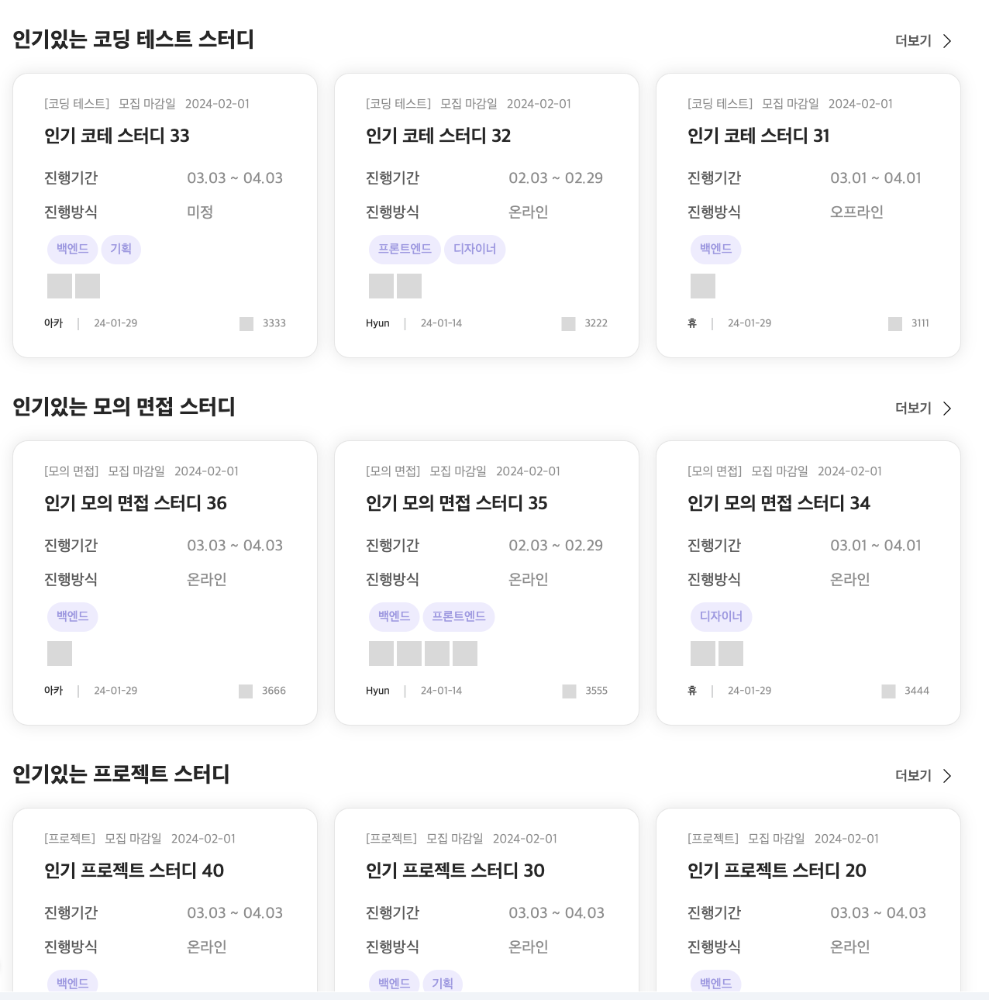

- [📓 MSW 적용 배경](#msw-적용-배경)
  - [1. 벡엔드 API에 의존적인 프론트엔드 개발 일정](#1-벡엔드-api에-의존적인-프론트엔드-개발-일정)
  - [2. 데이터를 내부 로직에 Mocking하는 방식의 한계](#2-데이터를-내부-로직에-mocking하는-방식의-한계)
- [📓 MSW 정의와 Service Worker](#msw-정의와-service-worker)
  - [1. MSW 정의](#1-msw-정의)
  - [2. Service Worker](#2-service-worker)
- [📓 MSW 동작 원리](#msw-동작-원리)
- [📓 MSW 적용](#msw-적용)
  - [📋 MSW 관련 폴더 및 파일 구조](#msw-관련-폴더-및-파일-구조)
  - [⛏ MSW 적용 과정](#msw-적용-과정)
  - [🎬 MSW 동작 확인](#msw-동작-확인)
- [🤔 MSW 적용 소감](#msw-적용-소감)
- [📓 참고자료](#참고자료)

[✔︎ 관련 PR - MSW를 활용한 Mocking 환경 구성](https://github.com/Ludo-SMP/ludo-frontend/pull/21)

Ludo 프로젝트 초기에 MSW를 도입하고, 이를 활용한 과정을 정리한 글입니다.

## 📓 MSW 적용 배경

프로젝트 기획 및 디자인 시안이 도출되고, 이를 기반으로 주요 기능 및 API 명세가 정해 진 후, 프론트엔드 개발이 본격적으로 시작되었습니다. 기능 구현에 앞서 프론트엔드 팀원간의 업무 분배를 진행하였고, 백엔드 API 개발 소요 시간을 고려하여 페이지 마크업 작업을 선행하였습니다. 또한 마크업 작업을 완료한 후, API의 응답으로 내려오게 될 데이터의 상태를 Application 내부 로직에 Mocking하여 기능 구현을 진행하였습니다. 이러한 방식으로 프론트엔드 개발을 진행하던 중 다음과 같은 문제를 마주치게 되었습니다.

### 1. 벡엔드 API에 의존적인 프론트엔드 개발 일정

<p align = "center"></p>

백엔드 API 개발 일정에 의존적인 프론트엔드 개발을 진행함에 따라, 전체적인 개발 스케쥴이 정해져 있는 상황에서 프론트엔드 파트의 기능 구현, 리팩토링 및 유지 보수의 시간이 줄어들게 됩니다. 이는 곧 장기적인 관점에서 프로젝트의 퀄리티에 영향을 미칠 것이라 판단되었습니다.

### 2. 데이터를 내부 로직에 Mocking하는 방식의 한계

Application 내부 로직에 데이터의 상태를 Mocking하는 방식은 구현이 쉽고 빠르게 적용할 수 있다는 장점이 있었습니다. 하지만 서비스 로직을 수정하여 Mock Data를 넣어줌으로써, 나중에 실제 API를 연결할 때 기존에 작성한 코드 수정이 불가피했습니다. 뿐만 아니라 Mock Data를 넣는 방식으로는 다양한 HTTP 메서드 및 네트워크 응답 상태에 대해 대응하는데 한계가 있었습니다.

이에 따라 다음과 같은 기준을 설정하고 해결방안을 모색했습니다.

- 실제 API를 사용하는 것처럼 네트워크 수준에서 Requset를 가로채 Mocking 할 수 있어야 한다.
- HTTP 메서드 및 응답 상태에 따른 대응을 할 수 있어야한다.
- Mocking 환경을 구축하는데 공수가 많이 들지 않아야한다.
- 서비스 로직에 대한 수정이 필요없어야 한다.

그 결과 이러한 기준을 충족하는 MSW를 프로젝트에 도입하게 되었습니다.

## 📓 MSW 정의와 Service Worker

### 1. MSW 정의

MSW 공식문서에는 MSW를 다음과 같이 정의하고 있습니다.

> **Industry standard API mocking for JavaScript**
> Mock Service Worker is an API mocking library that allows you to write client-agnostic mocks and reuse them across any frameworks, tools, and environments.

이는 MSW는 **어느 클라이언트이든지 상관없이 mock을 작성 가능하며, 모든 프레임워크/Tool/환경에서 재사용 가능한 JS API Mocking 라이브러리**로 정리할 수 있습니다.

이렇게 MSW가 클라이언트에 상관없이 mock을 작성할 수 있는 이유는 무엇일까요? 그것은 바로 Service Worker를 사용하기 때문입니다.

### 2. Service Worker

MSW는 풀네임인 Mock Service Worker에서 알 수 있듯이 Service Worker를 활용한 라이브러리입니다. Service Worker란 웹 애플리케이션의 메인 스레드 분리된 백그라운드 스레드에서 실행되는 스크립트로, 이로 인해 UI를 차단하지 않고 백그라운드에서 작업을 처리할 수 있습니다. 이로인해 백그라운드 동기화, 푸시 알림들의 기능을 구현할 때 사용됩니다.

뿐만 아니라 Service Worker는 fetch 이벤트를 통해 네트워크 요청을 가로채고, 이 요청을 캐시에서 제공하거나, 네트워크로 전달하거나, 요청을 수정할 수 있습니다. 이러한 기능을 수행하는 Service Worker를 MSW에 도입함으로써 실제 서버에서 response를 보낸 것처럼 Mocking을 구현할 수 있으며, 이러한 클라이언트와 Worker간의 관심사를 분리를 통해 클라이언트의 프레임워크/Tool/환경에 상관없는 mock을 작성할 수 있습니다. 이는 MSW를 개발자가 작성한 글에서 확인할 수 있습니다.

> Using a Service Worker means having no request client stubs *and* sending authentic responses from the network as if an actual server has sent them.
>
> This **separation of concerns** has clicked with me immediately because it provided me exactly what I was looking for: an interception algorithm that respects your application’s integrity. Moreover, by **separating the concerns** between the worker and the client, MSW is able to ship a snappy and reactive experience not affected by lazy worker updates or the worker’s life cycle phases.
>
> _- Artem Zakharchenko (MSW 개발자)_
>
> Service Worker를 사용하는 것은 request client stub이 없고 실제 서버가 보낸 것처럼 네트워크에서 실제 응답을 보내는 것을 의미합니다. 이러한 **_관심사의 분리(separation of concern)_**는 제가 찾던 것을 정확히 제공했기 때문에 저에게 즉시 적용되었습니다. 즉, 애플리케이션의 무결성을 존중하는 가로채기 알고리즘입니다. 게다가 MSW는 worker와 클라이언트 간의 **_관심사를_ 분리**함으로써 lazy worker update나 worker의 수명 주기 단계에 영향을 받지 않는 빠르고 반응성 있는 경험을 제공할 수 있습니다.

## 📓 MSW 동작 원리

<p align = "center"></p>

Application에서 Service Worker 설치 및 등록이 완료된 후, MSW의 동작원리는 다음과 같습니다.

1. Application(Browser)에서 서버에 request를 보냅니다. 이 때 Service Worker가 네트워크 Request를 가로챕니다.
2. Service Worker가 가로챈 request를 복사하여 MSW에 전달합니다.
3. MSW에서 사용자가 정의한 handler와 request를 매칭하는 과정을 진행합니다.
4. 매칭된 handler에서 반환하는 Mocked response(모의 응답)을 Service Worker에게 전달합니다.
5. Service Worker가 Mocked Response를 Application(Browser)에 전달합니다.

## 📓 MSW 적용

MSW의 동작원리를 학습한 후, 실제로 MSW를 적용하는 과정을 진행했습니다.

여러 기능을 구현하는 데 MSW를 적용하였으며, 본 글에서는 메인페이지에서 인기 모집공고를 불러오는 request에 대한 mocking한 과정을 설명하겠습니다.

먼저 관련 폴더 및 파일 구조는 다음과 같습니다.

### 📋 MSW 관련 폴더 및 파일 구조

```
-- public
  -- mockServiceWorker.js => **Service Worker 파일**
  -- index.html
-- src
  -- mocks
    -- data => **Mock Data**
    -- handlers => **Mock Response를 반환하는 handler**
    -- uitls => **Mock Data를 변환하는 uitil 함수**
    -- browser.ts => **worker Instance 생성 파일**
  -- App.tsx => **Root Component**
  -- index.tsx => **Entry point**
```

### ⛏ MSW 적용 과정

1.&nbsp;**MSW 라이브러리 설치**

먼저 MSW 라이브러리를 설치합니다.

```bash
yarn add msv --dev
```

2.&nbsp;**Service Worker Setup 및 Worker Instance 생성**

Service Worker를 등록하기 위해 MSW의 전용 CLI를 사용하여 Worker Script를 생성합니다.

```markdown
npx msw init public(지정경로) --save
```

이를 통해 지정한 public 폴더 하위에 worker 스크립트가 생성됩니다.

다음으로 Mock Response를 반환하는 handlers를 인수로 전달하여 worker Instance를 생성합니다.

```tsx
// ../src/Mocks/browser.ts
import { setupWorker } from 'msw/browser';
import { handlers } from './handlers';

export const worker = setupWorker(...handlers);
```

3.&nbsp;**Entry Point에서 Worker 설정**

dev 환경에서 worker가 실행될 수 있도록, 애플리케이션의 Entry Point에서 조건부 worker 실행 코드를 설정합니다.

```tsx
// src/index.tsx
import ReactDOM from 'react-dom/client';
import { StrictMode } from 'react';

import App from './App.tsx';

const enableMocking = async () => {
  if (import.meta.env.DEV === false) return;
  const { worker } = await import('./mocks/browser');
  return worker.start();
};

enableMocking().then(() =>
  ReactDOM.createRoot(document.getElementById('root')!).render(
    <StrictMode>
      <App />
    </StrictMode>
  )
);
```

4.&nbsp;**인기 모집공고를 가져오는 api fetcher, Mock Data 및 Mock Handler를 정의**

인기 모집공고를 가져오는 API Fetcher와 Mock Data 및 handler 정의하였습니다.

**✔︎ API Fetcher**

```tsx
// src/apis/recruitments.ts
import { apiRequester } from '@/utils/axios';
import { useInfiniteQuery, useQuery } from '@tanstack/react-query';

export const getPopularRecruitments = () => apiRequester.get('/').then((res) => res.data);
export const usePopularRecruitments = () => {
  return useQuery({
    queryKey: ['popularRecruitments'],
    queryFn: () => getPopularRecruitments(),
  });
};
```

**✔︎ Mock Data**

```tsx
//src/Mocks/data/mockData.ts
export const recruitmentDetailMockData: RecruitmentDetailRawDataType[] = [
  {
    id: 1,
    title: '인기 코테 스터디 1',
    stacks: ['Java'],
    positions: ['백엔드'],
    ownerNickname: '휴',
    way: '오프라인',
    startDateTime: '2024-03-01',
    endDateTime: '2024-04-01',
    recruitmentEndDateTime: '2024-02-01',
    createdDateTime: '2024-01-29',
    hits: 111,
    applicantCount: 5,
    platformUrl: 'https://open.kakao.com/o/222222',
    content: 'coding test',
    category: '코딩 테스트',
    platform: '디스코드',
    memberCnt: 4,
    contact: '디스코드',
  },
  {
    id: 2,
    title: '인기 코테 스터디 2',
    stacks: ['Javascript'],
    positions: ['프론트엔드'],
    ownerNickname: 'Hyun',
    way: '온라인',
    startDateTime: '2024-02-03',
    endDateTime: '2024-02-29',
    recruitmentEndDateTime: '2024-02-01',
    createdDateTime: '2024-01-14',
    hits: 222,
    applicantCount: 5,
    platformUrl: 'https://open.kakao.com/o/222222',
    content: 'coding test',
    category: '코딩 테스트',
    platform: '디스코드',
    memberCnt: 4,
    contact: '디스코드',
  },
....
]

export const popularRecruitmentsMockData: PopularRecruitmentsRawDataType = {
  popularCodingRecruitments: [
    ...recruitmentDetailMockData
      .filter((recruitmentDetail: RecruitmentDetailRawDataType) => recruitmentDetail.category === '코딩 테스트')
      .map((recruitmentDetail: RecruitmentDetailRawDataType) => {
			(데이터 변환코드)...
			})
      .sort((a, b) => b.hits - a.hits)
      .slice(0, 3),
  ],
  popularInterviewRecruitments: [
		....
  ],
  popularProjectRecruitments: [
	  ....
  ],
};
```

**✔︎ Mock Handler**

```tsx
//src/Mocks/handlers/recruitments.ts
import { HttpResponse, http } from 'msw';
import { popularRecruitmentsMockData } from '../data/mockData';

const baseURL = import.meta.env.VITE_MOCK_API_URL;

const getPopularRecruitments = http.get(`${baseURL}`, () => {
  return new HttpResponse(
    JSON.stringify({ data: popularRecruitmentsMockData, message: 'Success' }),
    {
      status: 200,
      statusText: 'OK',
    }
  );
});
```

5.&nbsp;**메인페이지에 정의한 api fetcher 적용**

인기있는 모집공고 데이터를 렌더링할 메인 페이지에 api fetcher를 적용하였습니다.

```tsx
//src/pages/main.tsx
import styled from 'styled-components';
import { bannerDummy } from '../../Shared/dummy';
import Banner from '../../Components/Banner';
import { usePopularRecruitments } from '@/Apis/recruitment';
import { convertPopularRecruitmentsToStudyCardProps } from '@/Utils/propertyConverter';
import CardListInfo from '@/Components/CardListInfo';
import PopularStudyCardList from '@/Components/PopularCardList';
import Button from '@/Components/Common/Button';
import { Up } from '@/Assets';
import UtiltiyButtons from '@/Components/UtilityButtons';

const Main = () => {
  const { data, isLoading } = usePopularRecruitments();
...

  return isLoading ? (
    <div>Loading...</div>
  ) : (
    <MainWrapper>
     ....
      <StudyListWrapper>
        <CardListInfo studyCategory="코딩 테스트" />
        <PopularStudyCardList studyCardsProps={popularRecruitments?.popularCodingRecruitments} />
      </StudyListWrapper>
      <StudyListWrapper>
        <CardListInfo studyCategory="모의 면접" />
        <PopularStudyCardList studyCardsProps={popularRecruitments?.popularInterviewRecruitments} />
      </StudyListWrapper>
      <StudyListWrapper>
        <CardListInfo studyCategory="프로젝트" />
        <PopularStudyCardList studyCardsProps={popularRecruitments?.popularProjectRecruitments} />
      </StudyListWrapper>
      <UtiltiyButtons>
        <Button onClick={handleScroll} className="scroll__btn">
          <Up />
          <span>위로가기</span>
        </Button>
      </UtiltiyButtons>
    </MainWrapper>
  );
};
...
```

### 🎬 MSW 동작 확인

로컬 환경에서 개발자 도구의 Application 탭에서 확인한 결과, Service Worker가 잘 작동되고 있음을 확인하였습니다.

<details markdown="1">
<summary>Application 탭을 통한 Service Worker 동작 확인</summary>
  
</details>

<br>
또한 개발자 도구의 console 탭의 로그를 통해 MSW가 정상 실행되었음을 확인하였고, Worker로부터 Mock Response를 통해 인기 있는 모집공고 데이터를 가져온 것을 확인할 수 있었습니다.
<br><br>

<details markdown="1">
<summary>Console 로그를 통한 MSW 정상 실행 확인</summary>
  
</details>

<details markdown="1">
<summary>전달된 Mock Data 확인 - 1</summary>
  
</details>

<details markdown="1">
<summary>전달된 Mock Data 확인 - 2</summary>
  
</details>

<details markdown="1">
<summary>전달된 Mock Data 확인 - 3</summary>
  
</details>
<br>
마지막으로 Mock Response를 통해 전달된 인기 모집공고 데이터가 메인페이지에서 렌더링 되는 것을 확인하였습니다.
<br>
<br>
<details markdown="1">
<summary>메인페이지 렌더링 - 1</summary>
  
</details>

<details markdown="1">
<summary>메인페이지 렌더링 - 2</summary>
  
</details>

## 🤔 MSW 적용 소감

MSW의 2.0.0 버전 이 release된 시기가 2023년 10월이었고, 프로젝트에 MSW를 적용하기 결정한 시점은 1월 말이었습니다. 그리하여 기존에 사용사례를 찾아본 결과 1.x.x 버전으로 환경 설정을 진행한 레퍼런스가 대부분이어서, 처음에는 새로운 버전으로 MSW 설정을 하는 데에 부담을 느꼈습니다. 하지만 공식문서가 잘 정리되어 있어서, 우려와 다르게 빠르게 프로젝트에 적용할 수 있었습니다.

MSW 적용함 통해 느낀 장점을 요약하면 다음과 같습니다.

- 백엔드 API 개발 일정에 독립적인 프론트엔드 개발을 진행할 수 있었습니다.
- 다양한 네트워크 응답을 Mocking이 가능하여, 같은 페이지 내에서도 다양한 네트워크 응답에 대한 UI를 구현할 수 있었습니다.
- 클라이언트에서 handler를 작성할 수 있기 때문에, 기존의 로직과 정의된 타입을 재사용할 수 있었다는 점이 좋았습니다.

이러한 많은 장점을 지닌 MSW를 다른 프로젝트에서도 적용해 프론트엔드 개발의 생산성을 높이는데 활용할 예정입니다.

## 📓 참고자료

- [Service Worker](https://developer.mozilla.org/ko/docs/Web/API/Service_Worker_API)
- [Mocking으로 생산성까지 챙기는 FE 개발](https://tech.kakao.com/2021/09/29/mocking-fe/)
- [MSW(Mock Service Worker)로 더욱 생산적인 FE 개발하기](https://velog.io/@khy226/msw%EB%A1%9C-%EB%AA%A8%EC%9D%98-%EC%84%9C%EB%B2%84-%EB%A7%8C%EB%93%A4%EA%B8%B0#service-worker%EB%9E%80)
- [MSW](https://mswjs.io/)
- [Understanding API Mocking - Part 3: Mock Service Worker](https://egghead.io/blog/understanding-api-mocking-mock-service-worker)
- [Mock Service Worker로 만드는 모의 서버](https://blog.rhostem.com/posts/2021-03-20-mock-service-worker)
- [MSW로 API 모킹하기](https://medium.com/@iamkjw/msw%EB%A1%9C-api-%EB%AA%A8%ED%82%B9%ED%95%98%EA%B8%B0-29c80bbed37b)
