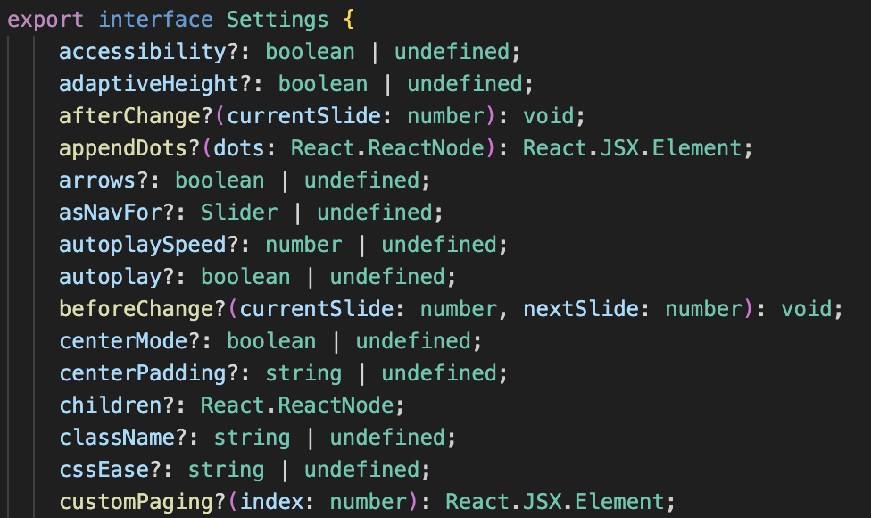

- [📓 React-Slick을 도입한 배경](#-react-slick을-도입한-배경)
- [📓 주요 기능 정의](#-주요-기능-정의)
- [📓 react-slick 주요 Options](#-react-slick-주요-options)
- [📓 배너 구현](#-배너-구현)
  - [💡라이브러리 설치](#라이브러리-설치)
  - [💡 Carousel 컴포넌트 구현](#-carousel-컴포넌트-구현)
  - [💡배너 이미지를 앞뒤로 넘기는 CustomArrowBtn 컴포넌트 구현](#배너-이미지를-앞뒤로-넘기는-customarrowbtn-컴포넌트-구현)
  - [💡 Carousel 컴포넌트의 Setting을 반환하는 함수 정의](#-carousel-컴포넌트의-setting을-반환하는-함수-정의)
  - [💡 Banner 컴포넌트 구현](#-banner-컴포넌트-구현)
  - [💡 서비스 소개 노션 링크 연결](#-서비스-소개-노션-링크-연결)
  - [💡 모바일 배너 이미지 적용](#-모바일-배너-이미지-적용)
- [📓 최종 배너 결과물](#-최종-배너-결과물)
  - [🎬 일정 시간 간격으로 이미지 슬라이딩](#-일정-시간-간격으로-이미지-슬라이딩)
  - [🎬 버튼으로 이미지 넘기기](#-버튼으로-이미지-넘기기)
  - [🎬 배너 반응형](#-배너-반응형)
- [📓 react-slick을 활용한 배너 구현기](#react-slick을-활용한-배너-구현기)
- [💡 다음 자료를 참고하면 좋아요.](#-다음-자료를-참고하면-좋아요)

react-slick 라이브러를 활용하여 banner를 구현한 과정을 기록한 글입니다.

[✔︎관련 PR](https://github.com/Ludo-SMP/ludo-frontend/pull/253)

## 📓 React-Slick을 도입한 배경

기존에 이미지가 넘어가는 간단한 기능만을 갖춘 배너를 구현했습니다. 하지만 배너에 추가적인 기능 요구 사항과 디자인 수정사항이 발생하였습니다. 그로 인해 여러 옵션을 통해 원하는 기능을 커스터마이징 할 수 있는 Banner 라이브러리 도입의 필요성을 느꼈고, 여러 브라우저와의 호환성을 보장하며 원하는 기능을 구현할 수 있는 옵션을 제공하는 `react-slick` 라이브러리를 도입하게 되었습니다.

## 📓 주요 기능 정의

<p align = "center"></p>

구현하기에 앞서 배너의 주요 기능을 정의하였습니다.

```
- 일정 시간 간격으로 슬라이딩 방식으로 다음 이미지로 넘어간다.
- 현재 맨 마지막 이미지인 경우 첫번째 이미지로 넘어간다.
- 화살표 버튼을 이용하여 이전 또는 이후의 이미지로 이동할 수 있다.
- 우측 하단에 `현재 이미지 번호 / 전체 이미지 개수`를 보여준다.
- breakpoint 500px을 기준으로 다른 이미지를 보여준다.
- 배너 이미지를 클릭하면 서비스 소개 페이지로 이동한다.
```

## 📓 react-slick 주요 Options

<p align = "center">

`react-slick` 라이브러리의 `Settings` 인터페이스에서는 배너에 적용할 수 있는 다양한 옵션을 제공하고 있습니다. 이 중 적용하고자 하는 기능에 해당하는 options의 property를 정리 및 학습했습니다.

```
- dots : 배너의 contents 갯수만큼 점으로 표시하는 dot의 유무
- autoplay : 자동스크롤 유무
- autoplaySpeed : 다음으로 넘어가는데 걸리는 시간(ms)
- draggable : 드래그 가능 여부
- infinite: 무한 반복 여부
- speed : 버튼으로 다음 이미지 보이는데 걸리는 시간(ms)
- slidesToShow: 배너에 보여질 이미지의 개수
- arrows: 앞뒤로 넘기는 arrow 유무
- prevArrow: 이전으로 이동하는 화살표 컴포넌트
- nextArrow: 다음으로 이동하는 화살표 컴포넌트
- beforeChange: 슬라이더의 인덱스가 변경되기 직전에 호출되는 콜백함수
```

## 📓 배너 구현

### 💡라이브러리 설치

이미지 갤러리, 콘텐츠 슬라이더 등의 UI를 구현하는 옵션을 제공하는 `slick-slider`라이브러리와 이를 react에서 적용하기 위한 래핑 라이브러리인 `react-slick을 설치합니다.

```cmd
yarn add react-slick slick-slider @types/react-slick
```

### 💡 Carousel 컴포넌트 구현

Banner의 자식 컴포넌트인 Carousel을 `react-slick`의 `Slider` 모듈을 이용해 구현했습니다. 이때 props로 배너의 기능을 정의하는 `Settings` 타입의 `option` 프로퍼티를 전달하여 배너를 커스터마이징할 수 있게 구현했습니다.

```tsx
import Slider, { Settings } from 'react-slick';
import 'slick-carousel/slick/slick.css';
import 'slick-carousel/slick/slick-theme.css';

export interface CarouselProps {
  options?: Settings;
  children?: React.ReactNode;
}

export const Carousel = ({ options, children }: CarouselProps) => {
  return <Slider {...options}>{children}</Slider>;
};
```

### 💡배너 이미지를 앞뒤로 넘기는 CustomArrowBtn 컴포넌트 구현

클릭하여 이미지를 앞 뒤로 넘길 수 있는 CustomArrowBtn을 구현하였습니다. 이때 `CustomArrowBtnprops`의 `type` 프로퍼티를 통해 버튼의 모양이 정해지도록 하였습니다.

```tsx
export interface CustomArrowBtnprops {
  type: 'PREV' | 'NEXT';
}

export const CustomArrowBtn = ({
  type,
  onClick,
}: CustomArrowBtnprops & Pick<CustomArrowProps, 'onClick' | 'style'>) => {
  return (
    <CustomArrowBtnWrapper $type={type} onClick={onClick}>
      {type === 'PREV' ? <PrevArrow /> : <NextArrow />}
    </CustomArrowBtnWrapper>
  );
};
```

### 💡 Carousel 컴포넌트의 Setting을 반환하는 함수 정의

현재 슬라이드의 index를 반영한 Setting을 Carousel 컴포넌트로 전달해야 했기에, 설정을 반환하는 `createCarouselOptions`를 작성하였습니다. 이때 `handleSlideIdx` 함수를 인자로 설정하여 슬라이더의 인덱스가 변경되기 직전에 호출되는 콜백함수를 전달했습니다.

```tsx
import { Settings } from 'react-slick';

export const createCarouselOptions = (
  handleSlideIdx: React.Dispatch<SetStateAction<number>>
): Settings => {
  return {
    /** 배너의 contents 갯수로를 표시하는 dot의 유무 */
    dots: false,

    /** 자동 스크롤 사용 유무 */
    autoplay: true,

    /** 다음으로 넘어가는데 걸리는 시간(ms) */
    autoplaySpeed: 5000,

    /** 드래그 가능 여부 */
    draggable: false,

    /** 무한 반복 */
    infinite: true,

    /** 버튼으로 다음 이미지 보이는데 걸리는 시간(ms) */
    speed: 400,

    /** 배너에 보여질 이미지의 개수 */
    slidesToShow: 1,

    /** 앞뒤로 넘기는 arrow 유무 */
    arrows: true,

    /** 이전으로 이동하는 화살표 컴포넌트 */
    prevArrow: <CustomArrowBtn type="PREV" />,

    /** 다음으로 이동하는 화살표 컴포넌트 */
    nextArrow: <CustomArrowBtn type="NEXT" />,

    /** 슬라이더의 인덱스가 변경되기 직전에 호출되는 콜백함수 */
    beforeChange: (_, next) => handleSlideIdx(next + 1),
  };
};
```

### 💡 Banner 컴포넌트 구현

`Carousel` 컴포넌트를 자식으로 하는 Banner 컴포넌트를 구현했습니다. 이 때 banner 컴포넌트 내에 현재 이미지의 인덱스를 의미하는 `slideIdx`(초기값=1)를 `useState`를 통해 정의하고, 인덱스의 변화를 트리거하는 `setSlideIdx`를 `createCarouselOptions`에 전달하였습니다. 이를 통해 넘겨준 index
handler를 `beforeChange`(슬라이더의 인덱스가 변경되기 직전에 호출되는 콜백함수)에 적용시켜 슬라이드가 넘어갈 때 index가 변경되도록 하는 `CarouselOptions`를 생성하였고 이를 `Carousel` 컴포넌트의 props로 전달하였습니다.

```tsx
export const createCarouselOptions = (handleSlideIdx: React.Dispatch<SetStateAction<number>>): Settings => {
  return {
    ....
    /** 슬라이더의 인덱스가 변경되기 직전에 호출되는 콜백함수 */
    beforeChange: (_, next) => handleSlideIdx(next + 1),
  };
};

const Banner = () => {
  const banners = [Banner1, Banner2];
  const mobileBanners = [MobileBanner1, MobileBanner2];
  const [slideIdx, setSlideIdx] = useState<number>(1);
  const carouselOptions = createCarouselOptions(setSlideIdx);

  return (
    <BannerBox>
      <Carousel options={carouselOptions}>
          ....
      </Carousel>
      <SlideIdxBox>{`${slideIdx}  /  ${banners.length}`}</SlideIdxBox>
    </BannerBox>
  );
};
```

### 💡 서비스 소개 노션 링크 연결

BannerItemList에 Link를 사용하여, 새로운 탭으로 서비스 노션 페이지로 이동하도록 구현하였습니다.

```tsx
const Banner = () => {
   ...
  return (
    <BannerBox>
      <Carousel options={carouselOptions}>
        {banners.map((banner, idx) => (
          <BannerItemList key={idx} to={NOTION_URL} target="_blank">
            <BannerImage src={banner} srcSet={`${mobileBanners[idx]} 500w, ${banner}`} alt="banner" />
          </BannerItemList>
        ))}
      </Carousel>
      .....
    </BannerBox>
  );
};

const BannerItemList = styled(Link)`
  display: block;
  cursor: pointer;
  width: 100%;
`;
```

### 💡 모바일 배너 이미지 적용

img 태그의 srcSet을 이용하여, 특정 viewport에 적합한 image가 렌더링되도록 구현하였습니다.

```tsx
const Banner = () => {
   ...
  return (
    <BannerBox>
      <Carousel options={carouselOptions}>
        {banners.map((banner, idx) => (
          <BannerItemList key={idx} to={NOTION_URL} target="_blank">
            <BannerImage src={banner} srcSet={`${mobileBanners[idx]} 500w, ${banner}`} alt="banner" />
          </BannerItemList>
        ))}
      </Carousel>
      .....
    </BannerBox>
  );
};
```

## 📓 최종 배너 결과물

### 🎬 일정 시간 간격으로 이미지 슬라이딩

<p align = "center">

### 🎬 버튼으로 이미지 넘기기

<p align = "center">

### 🎬 배너 반응형

<p align = "center">

## 📓 react-slick을 활용한 배너 구현기

`react-slick`에서 제공하는 여러 옵션을 적용하여 배너를 구현하는 과정에서 자동 슬라이딩, 무한 반복, 화살표 버튼을 통한 이미지 이동, 현재 이미지 인덱스 표시 등 사용자의 UX를 고려한 다양한 요구 사항을 빠른 시간 안에 구현할 수 있었습니다. 또한 `react-slick`의 공식 문서와 예제를 참고하며 다양한 설정 옵션을 실험하고, 각 옵션이 어떻게 동작하는지 명확히 이해할 수 있었습니다. 이번 경험을 통해, 상황에 맞는 적절한 라이브러리를 선택하여 UI 컴포넌트 개발을 더욱 효율적으로 진행하는 것의 중요성을 깨닫게 되었습니다.

## 💡 다음 자료를 참고하면 좋아요.

- [React-Slick Examples](https://react-slick.neostack.com/docs/example)
