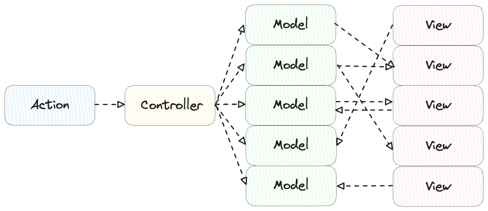
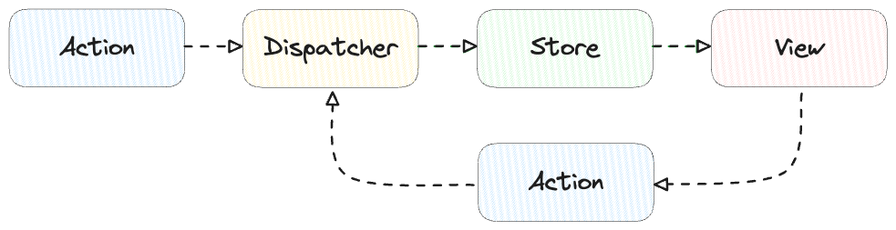

- [Flux 정의](#flux-정의)
- [MVC 패턴과 Flux의 탄생 배경](#mvc-패턴과-flux의-탄생-배경)
  - [MVC 패턴이란](#mvc-패턴이란)
  - [MVC 패턴의 한계](#mvc-패턴의-한계)
- [Flux란](#flux란)
  - [Flux의 구성 요소와 역할](#flux의-구성-요소와-역할)
  - [Flux에서의 데이터 흐름](#flux에서의-데이터-흐름)
  - [Flux 아키텍처의 장점](#flux-아키텍처의-장점)
- [요약 및 마무리](#요약-및-마무리)
- [Reference](#reference)

프로젝트에서 사용한 전역 상태 라이브러리인 Zustand에 적용된 **Flux 아키텍처**를 학습한 내용입니다.

## Flux 정의

공식문서에는 Flux를 다음과 같이 정의하고 있습니다.

```markdown
Application architecture for building user interfaces
```

다시 말해 Flux는 UI를 만들기 위한 Application 아키텍쳐입니다.

## MVC 패턴과 Flux의 탄생 배경

이러한 Flux 패턴이 나타난 이유를 알기 위해서는 기존에 많은 Application에서 사용된 아키텍쳐 패턴인 MVC 패턴의 문제점을 파악할 필요가 있습니다.

### MVC 패턴이란

<p align="center"></p>

MVC는 사용자 인터페이스, 데이터 및 논리 제어를 구현하는데 널리 사용되는 소프트웨어 디자인 패턴으로
비즈니스 로직과 화면을 구분하는데 중점을 두고 있습니다.

- Model : 데이터와 비즈니스 로직
- View : 사용자에게 보여지는 UI(화면)
- Controller : 사용자 입력을 처리하고, 애플리케이션의 흐름을 관리

### MVC 패턴의 한계

<p align = "center"></p>

이러한 MVC 패턴은 소규모 application에서는 큰 문제가 발생하지 않습니다. 하지만 많은 Model과 View가 혼재되어 있는 대규모 애플리케이션에서는 다음과 같은 문제가 발생합니다.

- Model의 업데이트가 view의 업데이트를 트리거하거나, view의 업데이트가 model의 update를 트리거함에 따라 애플리케이션의 Complexity(복잡도)가 증가합니다.
- 이러한 양방향 데이터 흐름(Bidirectional Data Flow)으로 연속적인 갱신이 발생하게 되고 불필요한 업데이트를 실행하게 됩니다. 이는 어플리케이션의 규모가 커지고<br>데이터의 연속적인 갱신이 되는 상황에서는 사용자 상호작용의 결과가 어떤 변화를 만드는지 예측하는데(Predictability) 어려워지는 결과로 이어집니다.
- 개발자가 코드의 실행흐름을 파악하기 어려워 유지 보수가 어려운 상황이 발생합니다.

**이러한 기존 MVC 패턴의 문제점을 해결하기 위해, 페이스북에서 Flux 아키텍처를 제시하였습니다.**

## Flux란

<p align="center"></p>

2014년 Hacker Way 컨퍼런스에서 Facebook이 MVC의 대안으로 제안한 Flux 아키텍처는 클라이언트 측 웹 애플리케이션을<br>구축하는 데 사용하는 애플리케이션 아키텍처입니다. Flux의 주요 특징은 **단방향 데이터 흐름(Unidirectional Data Flow)입니다.**

### Flux의 구성 요소와 역할

- Dispatcher : Action을 받아서 Store에 dispatch(전달)하는 중앙 허브 역할을 수행합니다.
  - Action : 행위에 대한 데이터를 담고있는 객체로, type으로 구분할 수 있습니다.
  - 모든 Action은 Store가 Dispatcher에 등록해 둔 콜백을 통해 모든 Store에 전송됩니다.
  - Store 사이에 의존성이 생기더라도, Dispatcher에 Action이 동기적으로 처리됩니다.
- Store: 애플리캐이션의 데이터(상태)를 관리합니다.
  - Store의 데이터는 Dispatcher에 의해 전달된 Action을 기반으로 갱신됩니다.
- View : 사용자에게 보여지는 UI

### Flux에서의 데이터 흐름

1. 여러 요인(ex. View에서의 사용자 Interaction, Web API)에 의해 Action 객체가 생성되어 dispatcher로 전달됩니다.
2. Dispatcher가 모든 store로 action을 전달합니다.
3. 전달받은 Action을 활용하여 Store에서 데이터가 갱신합니다.
4. Store에서 데이터가 갱신되었다는 이벤트를 View에서 수신한 후, View에서 새로운 데이터를 Store에서 가져와 UI를 갱신합니다.

### Flux 아키텍처의 장점

1. Improved Data consistency - 데이터의 일관성이 증가한다.
   Store의 데이터를 통해 View가 결정되기 때문에 특정 데이터가 갱신되었을 때, 해당 데이터를 사용하는 View들은 갱신된 동일한 데이터를 사용하게 됩니다.

2. Easier to pinpoint roof of bug - 버그의 원인 파악이 쉬워진다.
   단방향 데이터 흐름으로 인해 코드의 실행흐름을 파악하기 용이해지므로, 버그의 원인 파악이 쉬워지게 됩니다.

3. More meaningful unit test - 의미있는 Unit Test를 작성할 수 있다.
   상태와 상태를 업데이트 하는 로직이 동일한 곳(Store)에 있기 때문에, 특정 Input에 대한 상태 변화를 쉽게 테스트할 수 있게 됩니다.

4. Increase predictability - 예측 가능성을 높일 수 있다.
   단방향 데이터 흐름을 통해 연쇄적인 Model의 업데이트를 줄일 수 있게 되었고, 이에 따라 연쇄적인 업데이트를 피할 수 있게 되고, 데이터 흐름 파악이 쉬워짐에 따라 예측 가능성을 높일 수 있게 되었습니다.

## 요약 및 마무리

- 기존 MVC 패턴의 양방향 데이터 흐름으로 인해 발생한 문제점을 해결하기 위해, Flux 패턴이 도입되었습니다.
- Flux 아키텍처의 구성요소로는 Action을 Store로 전달하는 Dispatcher, 상태(데이터) 저장 및 업데이트를 수행하는 Store, Store로부터 받은 데이터로 화면을 그리는 View가 있습니다.
- Flux의 단방향 데이터 흐름을 통해 데이터의 일관성 증가, 코드의 유지보수 및 예측가능성 증가, 의미있는 Unit 테스트를 작성할 수 있게 되었습니다.

## Reference

- [Flux 공식문서](https://facebookarchive.github.io/flux/)
- [Hacker Way: Rethinking Web App Development at Facebook](https://www.youtube.com/watch?v=nYkdrAPrdcw&list=PLb0IAmt7-GS188xDYE-u1ShQmFFGbrk0v)
- [MVC - MDN](https://developer.mozilla.org/ko/docs/Glossary/MVC)
- [MVC (Model-View-Controller) 패턴](https://mundol-colynn.tistory.com/147#toc3)
- [Flux](https://velog.io/@hyunjine/Flux#flux)
- [Flux: Actions and the Dispatcher](https://legacy.reactjs.org/blog/2014/07/30/flux-actions-and-the-dispatcher.html)
- [In-Depth Overview](https://www.notion.so/7cd78a7766ba4cfa94d1a42aa5aff1e5?pvs=21)
- [The Rise of Flux: How Facebook’s Shift Away from MVC Led to a New Era of UI Architecture](https://medium.com/wix-engineering/the-rise-of-flux-how-facebooks-shift-away-from-mvc-led-to-a-new-era-of-ui-architecture-61d78b4377b0)
