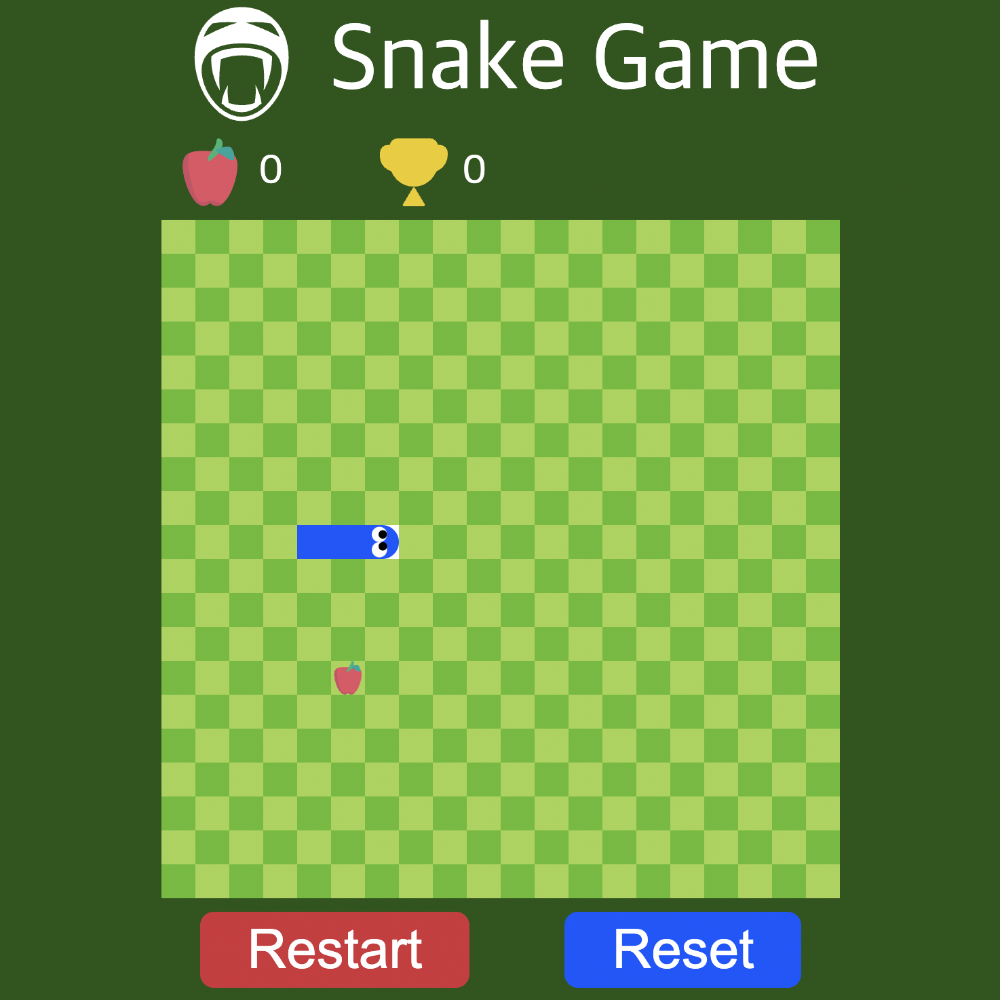
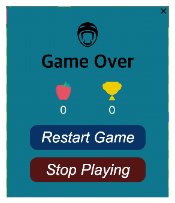
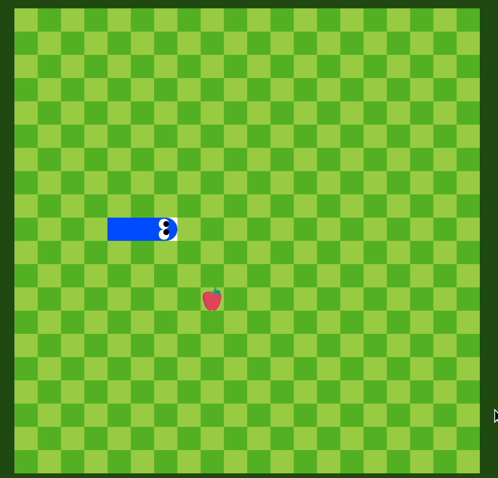

- [📓 SnakeGame 컴포넌트, 규칙 및 시나리오 설정](#-snakegame-컴포넌트-규칙-및-시나리오-설정)
  - [🛠 컴포넌트 설계](#-컴포넌트-설계)
  - [🎮 게임 규칙 설정](#-게임-규칙-설정)
  - [🎬 게임 시나리오](#-게임-시나리오)
- [📓 컴포넌트별 State 정의](#-컴포넌트별-state-정의)
- [📓 주요 기능 구현](#-주요-기능-구현)
  - [💡 게임 시작 기능](#-게임-시작-기능)
  - [💡 뱀의 이동 방향을 Control하는 기능](#-뱀의-이동-방향을-control하는-기능)
  - [💡 사과 랜덤 생성 기능](#-사과-랜덤-생성-기능)
  - [💡 일정 시간마다 뱀이 이동하는 기능](#-일정-시간마다-뱀이-이동하는-기능)
  - [💡 뱀이 벽 또는 Body와 충돌한 경우 게임을 종료하는 기능](#-뱀이-벽-또는-body와-충돌한-경우-게임을-종료하는-기능)
  - [💡 뱀이 사과를 먹고, 길이가 증가하는 기능](#-뱀이-사과를-먹고-길이가-증가하는-기능)
  - [💡 뱀이 앞으로 이동하는 기능](#-뱀이-앞으로-이동하는-기능)
  - [💡 ScoreBoard에 점수가 반영되는 기능](#-scoreboard에-점수가-반영되는-기능)
  - [💡 게임 종료 후, Modal이 활성화 되는 기능](#-게임-종료-후-modal이-활성화-되는-기능)
  - [💡 Modal을 닫는 기능](#-modal을-닫는-기능)
  - [💡 Modal에서 game을 Restart 또는 Stop하는 기능](#-modal에서-game을-restart-또는-stop하는-기능)
  - [💡 ControlBoard에서 game을 Restart / Reset하는 기능](#-controlboard에서-game을-restart--reset하는-기능)
- [📓 구현 시 어려웠던 점 및 해결 과정](#-구현-시-어려웠던-점-및-해결-과정)
  - [🤔 상태 기반 렌더링](#-상태-기반-렌더링)
  - [🤔 빠르게 연속적인 방향키 입력 시, Body와 충돌한 것으로 처리되는 문제](#-빠르게-연속적인-방향키-입력-시-body와-충돌한-것으로-처리되는-문제)
- [😃 JS SnakeGame 구현 및 정리 소감](#-js-snakegame-구현-및-정리-소감)
- [🧰 참고자료](#-참고자료)

<p align = "center"></p>

JavaScript를 활용하여 구현한 JS-SnakeGame의 구현 과정을 상세히 정리한 글입니다.

[✔︎ JS-SnakeGame 저장소](https://github.com/SungHyun627/JS-SnakeGame)

[✔︎ JS-SnakeGame 플레이](https://sunghyun627.github.io/JS-SnakeGame/)

## 📓 SnakeGame 컴포넌트, 규칙 및 시나리오 설정

기능 구현에 앞서 SnakeGame을 구성하는 컴포넌트와 게임 규칙 및 시나리오를 구체화하는 과정을 진행했습니다.

### 🛠 컴포넌트 설계

<div display="flex" align="center">
  <span align = "center">
  <span align = "center">
</div>

- Game Title : GameTitle을 표시하는 Component
- ScoreBoard : 실시간 점수와 최고 점수를 표시하는 Component
- Board(Game Board) : 뱀이 이동하면서 게임이 진행되는 Board Component
  - 초기 조건 : 20X20 Board, 길이가 3인 항상 동일한 셀에 위치하는 뱀, 랜덤한 위치에 생성되는 사과
- Control Board : 게임의 재시작 및 초기화 기능을 담당하는 Component
  - Restart Button, Reset Button
- Modal : 게임 결과 보여주고, button을 통해 재시작 여부를 정할 수 있는 Component
  - modal 상단에 있는 Close button
  - 게임의 결과를 보여주는 section
  - Restart Game Button
  - Stop Playing Button

### 🎮 게임 규칙 설정

- 뱀이 움직이는 보드판 각 셀의 좌표는 (열 번호, 행 번호)이며, 맨 왼쪽 위의 셀은 (0, 0), 맨 오른쪽 아래의 셀은 (19, 19)이다.
- 보드판을 움직이는 뱀이 사과를 먹으면 길이가 1 증가하고, 실시간 점수(🍎)가 1 증가한다.
- 점수는 ScoreBoard에서 실시간으로 갱신되며, 최고 점수(🏆)보다 실시간 점수(🍎)가 커지는 경우, 두 점수가 같은 값으로 동시에 증가한다.
- 게임 시작 전 뱀의 초기 위치는 (9, 4), (9, 5), Head(9, 6)이다.
- 뱀의 길이는 뱀이 차지하고 있는 셀의 개수와 동일하다.
- 방향키를 통해 뱀의 이동방향을 Control 할 수 있다.
- 이 뱀의 Body나 벽과 충돌할 경우 게임이 종료되고 Modal이 띄워진다.
- Modal에 실시간 점수와 최고 점수가 표시되며, 버튼을 통해 게임의 재시작 여부를 결정할 수 있다.
- 게임 하단 Control Board의 Restart/Reset 버튼을 통해 게임 재시작 여부 및 최고 점수 초기화 여부를 결정 할 수 있다.

### 🎬 게임 시나리오

1. **게임 시작 전** : 20x20의 board에 3개의 셀의 길이를 가진 뱀이 매번 동일한 위치에 생성되고, 뱀이 위치하고 있는 셀을 제외한 나머지 셀 중 랜덤으로 사과 한개가 생성된다. 실시간 점수(🍎)는 0, 최고 점수(🏆)는 이전 최고 기록이 표시된다.

2. **게임 시작** : 왼쪽 방향키를 제외한 방향키 버튼을 누르면 snake가 움직이면서 게임이 시작된다.
3. **게임 진행** : 게임 진행 중 다음과 같은 Event가 발생할 수 있다.
   - 3-1. 사과 획득 : 뱀이 사과에 있는 셀에 이르게 되면 다음의 방식으로 게임이 진행된다.
     - 3-1-1. 사과 제거 : 놓여있던 사과가 없어지고 해당위치에 뱀의 head가 위치한다.
     - 3-1-2. 뱀의 길이 증가 : 뱀이 증가할 때는 이전의 뱀이 차지하고 있던 cell의 영역에 획득한 사과가 놓아져있던 cell이 뱀의 head로 추가하는 방식으로 증가한다.
     - 3-1-3. 사과 랜덤 생성 : 뱀이 차지하고 있는 셀을 제외한 나머지 셀 중 랜덤으로 사과가 생성된다.
     - 3-1-4. 실시간 점수 증가 : 실시간 점수가 1 증가한다.
     - 3-1-5. Score Board에 점수 반영
       - 실시간 점수(Realtime score): 뱀이 사과를 먹으면 실시간 점수가 1 증가한다.
         최고 점수(Best score) : 실시간 점수와 값이 같아지는 순간부터, 실시간 점수와 최고점수가 동시에 1씩 증가한다.
     - 3-1-6. 게임이 계속 진행된다.
   - 3-2. 뱀의 head가 벽에 충돌 : 게임이 종료된다.
     3-3. 뱀의 head와 몸통이 충돌 : 게임이 종료된다.
     3-4. Control Board의 Restart 버튼 클릭 : 실시간 점수가 0이 되고, 게임 시작 전 상황으로 돌아간다.
     3-5. Control Board의 Reset 버튼 클릭: 실시간 점수, 최고 점수가 모두 0으로 reset되며 게임 시작 전 상황으로 돌아간다.
4. **게임 종료** : 3-2 또는 3-3과 같은 상황을 통해 게임이 종료되면 modal 창이 나타난다.
5. **modal 창을 통한 게임 Control**
   - Restart game 버튼을 클릭하면 modal 창이 사라지고, 게임 시작 전과 같은 상태로 게임을 다시 시작할 수 있다.
   - Stop playing 버튼을 클릭하거나, ESC키를 누르거나, modal 상단에 위치한 X버튼을 누르면 modal 창이 닫힌 후 게임이 종료된 화면으로 돌아간다.
6. **Control Board를 통한 게임 Control** : Control board에는 restart 버튼과 reset 버튼이 있고, 이를 통해 game을 control 할 수 있다.
   - Restart 버튼 : 실시간 점수는 0으로 초기화되고, 최고 점수는 유지 된 채로 게임 시작 전의 상태가 된다.
   - Reset 버튼: 실시간 점수와 최고 점수 모두 0으로 초기화 된 후 게임 시작 전의 상태가 된다.

## 📓 컴포넌트별 State 정의

정의한 컴포넌트, 게임 규칙 및 시나리오를 기반으로 각 컴포넌트별 State를 정의했습니다.

1. ScoreBoard : 실시간 점수와 최고 점수를 표시하는 Component
   - 실시간 점수(🍎, RealtimeScore)
   - 최고 점수(🏆, BestScore)
2. Board(Game Board) : 뱀이 이동하면서 게임이 진행되는 Board Component
   - SnakeQueue : 뱀이 차지하고 있는 셀의 위치를 담고 있는 배열
     - 셀의 위치는 열 번호, 행 번호의 정보를 포함하는 객체 상태로 표시 ex) {x : 10, y: 10}
     - SnakeQueue[0]은 뱀의 Head의 위치이며, 그 뒤로 차례로 뱀의 body를 이루는 cell의 위치 정보가 Queue에 저장
   - Direction : 뱀의 이동방향
     - Right: 0, Down: 1, Left: 2, Up: 3
   - gameState : 게임의 진행 상태
     - BEFORE_START : 게임 시작 전
     - PLAYING : 게임 진행 중
     - GAME_OVER : 게임 종료
   - snakeState : snake의 상태
     - STNAD_STLL : 게임 시작 전 뱀이 정지해 있는 상태
     - CHANGE_DIRECTION : 뱀이 방향을 바꾸고 있는 상태
     - MOVE_FORWARD : 뱀이 이동 방향으로 움직이는 상태
     - GET_APPLE : 뱀이 사과를 획득한 상태
     - COLLIDE_WITH_WALL : 벽과 충돌한 상태
     - COLLIDE_WITH_SNAKE_BODY : 뱀의 body와 충돌한 상태
   - applePos : 사과의 위치 정보를 담은 객체
   - removedApplePos : 제거된 사과의 위치 정보를 담은 객체
   - removedSnakePos: : 뱀이 차지했었던 셀의 위치 정보를 담은 객체
3. Modal : 게임 결과 보여주고, button을 통해 재시작 여부를 정할 수 있는 Component
   - modalState : modal의 display여부를 나타내는 state
     - HIDDEN : 모달이 보여지지 않는 상태. display: none
     - SHOW : 모달이 보여지는 상태

## 📓 주요 기능 구현

정의된 규칙 및 시나리오와 각 컴포넌트별 State를 기반으로 주요 기능을 구현했습니다.

### 💡 게임 시작 기능

- 초기 뱀의 방향이 오른쪽이므로, 왼쪽 방향키를 눌렀을 때는 무시
- 왼쪽 방향키를 제외한 나머지 방향키를 누르면 게임 시작
- 초기 Board Component 생성 시 키 입력을 받는 이벤트 핸들러 부착 후, 키 입력 시 게임 시작 조건에 부합하는 지 검증한 뒤, 게임을 시작하는 방식으로 구현

```js
  // src/components/Board.js

export default class Board {
  constructor({ $target, ...props }) {
  this.initEvent();
  ....
}

initEvent() {
  window.addEventListener(
  'keyup',
  debounce((e) => this.getDirection(e), INTERVAL_TIME)
  );
}

// src/components/Board.js

export default class Board {
  ....
  getDirection(e) {
  if (isSatisfyingGameStartCondition(e, this.state.gameState, this.state.direction)) {
    this.startGame(e);
    return;
  }
    ....
  }

  startGame(e) {
    this.setState({
    gameState: GAME_STATE.PLAYING,
    direction: directions[e.key.replace('Arrow', '')],
    snakeState: SNAKE_STATE.CHANGE_DIRECTION,
    });
    this.startTimer();
  }
  ....
}
```

### 💡 뱀의 이동 방향을 Control하는 기능

- 같은 방향 또는 반대 방향의 방향키를 눌렀을 때는 무시
- 90도 방향의 방향키를 눌렀을 때, 뱀의 이동 방향 전환
- 초기 Board Component 생성 시 키 입력을 받는 이벤트 핸들러 부착한 다음, 키 입력 시 방향 전환 조건에 부합하는 지 검증한 뒤, 방향을 전환하는 방식으로 구현

```js
  // src/components/Board.js

export default class Board {
  constructor({ $target, ...props }) {
    this.initEvent();
    ....
  }

  initEvent() {
    window.addEventListener(
      'keyup',
      debounce((e) => this.getDirection(e), INTERVAL_TIME)
    );
  }

  getDirection(e) {
    if (isSatisfyingChangeDirectionCondition(e, this.state.gameState, this.state.direction))
      this.changeDirection(e);
  }

  changeDirection(e) {
    this.setState({
      direction: directions[e.key.replace('Arrow', '')],
      snakeState: SNAKE_STATE.CHANGE_DIRECTION,
    });
  }
}
```

### 💡 사과 랜덤 생성 기능

- 현재 뱀이 차지하고 있는 셀을 저장하고있는 Queue를 인자로 받아, 뱀이 차지 하고 있는 셀은 사과 생성 셀 후보에서 제외하는 방식으로 구현

```js
  // src/utils/createApplePosition.js

import { BOARD_ROW_LENGTH } from '../constants/constants.js';
import { comparePos } from './getPositions.js';

const getRandom = () => Math.floor(Math.random() \* BOARD_ROW_LENGTH);

export const createApplePos = (snakeQueue) => {
  const applePos = { x: getRandom(), y: getRandom() };
  if (snakeQueue.some((snakePos) => comparePos(snakePos, applePos))) return createApplePos(snakeQueue);
  return applePos;
};
```

### 💡 일정 시간마다 뱀이 이동하는 기능

- 뱀이 이동하는 함수(moveSnake)를 일정시간 간격으로 실행
- moveSnake함수에서 뱀의 head가 위치할 cell을 계산 후, 뱀의 다음 행동을 실행
- Scheduler 인스턴트를 생성하여, moveSnake함수를 일정 시간간격으로 실행하는 방식으로 구현

```js
// src/components/Board.js

export default class Board {
  constructor({ $target, ...props }) {
  this.state = {
  ...INITIAL_BOARD_STATE,
  applePos: { ...createApplePos(INITIAL_BOARD_STATE.snakeQueue) },
  };
  this.scheduler = new Scheduler(this.moveSnake.bind(this), INTERVAL_TIME);
  }

  moveSnake() {
   const { nextHeadPosX, nextHeadPosY } = getNextSnakeHeadPos(
    this.state.snakeQueue[0].x,
    this.state.snakeQueue[0].y,
    this.state.direction
   );

   const nextSnakeQueue = copySnakeQueue(this.state.snakeQueue);
   nextSnakeQueue.unshift({ x: nextHeadPosX, y: nextHeadPosY });

    if (isCollidingWithWall(....)) {.... break}
    if (isCollidingWithSnakeBody(....)) {.... break}
    if (isSnakeGetApple(....)) {.... break}
    this.moveForWard(nextSnakeQueue);
  }
}

// src/utils/Scheduler.js

export class Scheduler {
  constructor(callback, interval) {
    this.callback = callback;
    this.isEnd = false;
    this.timerId = null;
    this.interval = interval;
  }

  start() {
    this.isEnd = false;
    this.play();
  }

  play() {
    setTimeout(() => {
      if (this.isEnd) {
        this.timerId = null;
        return;
      }
      if (this.timerId !== null) clearTimeout(this.timerId);
      this.timerId = this.callback();
    this.play();
    }, this.interval);
  }

  end() {
    this.isEnd = true;
  }
}
```

### 💡 뱀이 벽 또는 Body와 충돌한 경우 게임을 종료하는 기능

- 뱀이 벽 또는 뱀의 Body와 충돌한 조건에 부합한 지 확인 후, gameState와 snakeState를 setState함수를 통해 갱신
- 게임 종료 시 Scheduler의 타이머를 종료하여 moveSnake함수가 더 이상 실행 되지 않도록 구현
- 실시간 점수를 modal에 전달한 후, modal을 활성화

```js
// src/components/Board.js

export default class Board {
....
  moveSnake() {
    const { nextHeadPosX, nextHeadPosY } = getNextSnakeHeadPos(
      this.state.snakeQueue[0].x,
      this.state.snakeQueue[0].y,
      this.state.direction
    );
    const nextSnakeQueue = copySnakeQueue(this.state.snakeQueue);

    nextSnakeQueue.unshift({ x: nextHeadPosX, y: nextHeadPosY });
    if (isCollidingWithWall(nextHeadPosX, nextHeadPosY)) {
      this.collideWithWall();
      return;
    }
    if (isCollidingWithSnakeBody(nextHeadPosX, nextHeadPosY, nextSnakeQueue.slice(1, -1))) {
      this.collideWithSnakeBody();
      return;
    }
    ....
  }

  collideWithWall() {
    this.setState({ gameState: GAME_STATE.GAME_OVER, snakeState: SNAKE_STATE.COLLIDE_WITH_WALL });
    this.gameOver();
  }

  collideWithSnakeBody() {
    this.setState({
      gameState: GAME_STATE.GAME_OVER,
      snakeState: SNAKE_STATE.COLLIDE_WITH_SNAKE_BODY,
    });
    this.gameOver();
  }

  gameOver() {
    this.endTimer();
    const realTimeScore = getScore(this.state);
    this.props.setScoreInModal(realTimeScore);
    this.props.showModal();
  }
  endTimer() {
    this.scheduler.end();
  }
}
```

### 💡 뱀이 사과를 먹고, 길이가 증가하는 기능

- 뱀이 사과를 먹는 조건에 부합하는 지 확인 후, snakeQueue, snakeState, removedApplePos, applePos을 setState을 통해 갱신
- 사과를 뱀이 먹은 후, board에 새로운 사과를 생성
- 뱀이 사과를 먹으면 이전 뱀이 차지하고 있던 셀에 사과가 있던 셀을 뱀의 body로 추가하는 방식으로 구현

```js
// src/components/Board.js
export default class Board {
....
  moveSnake() {
    const { nextHeadPosX, nextHeadPosY } = getNextSnakeHeadPos(
      this.state.snakeQueue[0].x,
      this.state.snakeQueue[0].y,
      this.state.direction
    );
    const nextSnakeQueue = copySnakeQueue(this.state.snakeQueue);
    nextSnakeQueue.unshift({ x: nextHeadPosX, y: nextHeadPosY });
    ....
  if (isSnakeGetApple(nextHeadPosX, nextHeadPosY, this.state.applePos)) {
      this.getApple(nextSnakeQueue);
      return;
    }
  }
  ....
  getApple(nextSnakeQueue) {
    this.setState({
      snakeQueue: copySnakeQueue(nextSnakeQueue),
      applePos: {
        ...createApplePos(nextSnakeQueue),
      },
      removedApplePos: { ...this.state.applePos },
      snakeState: SNAKE_STATE.GET_APPLE,
    });
    const realTimeScore = getScore(this.state);
    this.props.setScoreInScoreBoard(realTimeScore);
  }
}
```

### 💡 뱀이 앞으로 이동하는 기능

- 뱀이 충돌하지 않거나, 사과를 획득하지 않을 경우, 뱀은 현재 이동방향으로 앞으로 전진
- 뱀의 body에서 제거해야 할 셀의 위치를 removedSnakepos에 할당

```js
// src/components/Board.js

export default class Board {
  moveSnake() {
    const { nextHeadPosX, nextHeadPosY } = getNextSnakeHeadPos(
      this.state.snakeQueue[0].x,
      this.state.snakeQueue[0].y,
      this.state.direction
    );

    const nextSnakeQueue = copySnakeQueue(this.state.snakeQueue);
    extSnakeQueue.unshift({ x: nextHeadPosX, y: nextHeadPosY });

    this.moveForWard(nextSnakeQueue);
  }

  moveForWard(nextSnakeQueue) {
    const nextRemovedSnakePos = nextSnakeQueue.pop();
    this.setState({
      snakeQueue: copySnakeQueue(nextSnakeQueue),
      removedSnakePos: nextRemovedSnakePos,
      snakeState: SNAKE_STATE.MOVE_FORWARD,
    });
  }
}
```

### 💡 ScoreBoard에 점수가 반영되는 기능

- ScoreBoard의 실시간 점수(realtimeScore)의 초기 값은 0, 최고 점수(bestScore)는 sessionStorage로부터 가져온 값으로 설정
- 사과를 획득하였을 시 ScoreBoard component의 setScore 함수를 실행하여, 바뀐 점수를 반영
- 실시간 점수가 최고 점수보다 커지는 경우, 두 값이 같은 값으로 동시에 증가하게 되며, 변화한 최고 점수를 SessionStorage에 반영

```js
//src/App.js

export default class App {
  constructor(container) {
    this.rootContainer = container;
    this.init();
  }

  init() {
    ....
    this.$scoreBoard = new ScoreBoard({ $target: scoreBoardContainer });
    this.$board = new Board({
      $target: boardContainer,
      showModal: () => this.#showModal(),
      setScoreInScoreBoard: () => this.#setScoreInScoreBoard(),
      setScoreInModal: (realtimeScore) => this.#setScoreInModal(realtimeScore),
    });
  ....
  }

  #setScoreInScoreBoard() {
  	return this.$scoreBoard.setScore();
  }
}

// src/components/scoreBoard.js
export default class ScoreBoard {
  constructor({ $target }) {
    this.state = { realtimeScore: 0, bestScore: 0 };
    this.target = $target;
    this.init();
  }

  init() {
    this.target.innerHTML = $scoreBoardTemplate;
    this.setState({ realtimeScore: 0, bestScore: getBestScoreFromSession() });
  }

  setState(newState) {
    this.state = { ...this.state, ...newState };
    this.render();
  }

  render() {
    ....
  }

  setScore() {
    const newRealtimeScore = this.state.realtimeScore + 1;
    if (isRealtimeScoreBiggerThanBestScore(newRealtimeScore, this.state.bestScore)) {
      this.setState({ realtimeScore: newRealtimeScore, bestScore: newRealtimeScore });
      setBestScoreInSession(newRealtimeScore);
    } else {
    this.setState({ realtimeScore: newRealtimeScore });
    }
  }
}
```

### 💡 게임 종료 후, Modal이 활성화 되는 기능

- 충돌로 인해 game이 종료 시, board에서 showModal 함수를 실행 시킨 후, modal에서 openModal 함수를 실행시켜,
  Modal state를 SHOW로 변경시키는 방식으로 modal 활성화 구현
- board에서 setScoreInModal을 통해 실시간 점수를 modal로 전달하여, modal에서 실시간 점수가 보여지도록 구현

```js
//src/App.js
export default class App {
  constructor(container) {
    this.rootContainer = container;
    this.init();
  }

  init() {
    ....
    this.$board = new Board({
      $target: boardContainer,
      showModal: () => this.#showModal(),
      setScoreInScoreBoard: (realtimeScore) => this.#setScoreInScoreBoard(realtimeScore),
      setScoreInModal: (realtimeScore) => this.#setScoreInModal(realtimeScore),
    });
		....
    this.$modal = new Modal({
      $target: modalContainer,
      restartGame: () => this.#restartGame(),
    });
  ....
}

  #setScoreInModal(realtimeScore) {
    return this.$modal.setScore(realtimeScore);
  }

  #showModal() {
    this.$modal.openModal();
  }
}

//src/components/Board.js

export default class Board {
  constructor({ $target, ...props }) {
    ....
    this.props = props;
    ....
  }

  gameOver() {
    this.endTimer();
    const realTimeScore = getScore(this.state);
    this.props.setScoreInModal(realTimeScore);
    this.props.showModal();
   }
}

//src/components/Modal.js

export default class Modal {
  constructor({ $target, ...props }) {
    this.state = { modalState: MODAL_STATE.HIDDEN };
    ....
    this.props = props;
    this.init();
    this.initEvent();
  }

  init() {
    this.target.innerHTML = $modalTemplate;
    hideModal(this.target);
  }

  setState(newState) {
    this.state = { ...this.state, ...newState };
    const $modalState = this.state.modalState;
    const $target = this.target;
    if ($modalState === MODAL_STATE.HIDDEN) hideModal($target);
    if ($modalState === MODAL_STATE.SHOW) showModal($target);
  }

  initEvent() {
    ....
    const modalRestartBtn = getModalRestartBtnElement(this.target);
    const modalStopPlayingBtn = getModalStopPlayingBtnElement(this.target);
    ....
    modalRestartBtn.addEventListener('click', this.closeModalForRestartGame.bind(this));
    modalStopPlayingBtn.addEventListener('click', this.closeModal.bind(this));
  }

  openModal() {
    this.setState({ modalState: MODAL_STATE.SHOW });
  }

  setScore(realtimeScore) {
    const $target = this.target;
    printModalRealTimeScore($target, realtimeScore);
    printModalBestScore($target);
  }
}
```

### 💡 Modal을 닫는 기능

- Modal이 활성화 되어있는 상태일 때, Modal 창을 닫는 방법을 다음과 같은 경우로 제한
  - Reastart Game Button 또는 Stop Playing Button을 눌렀을 때
  - Modal 오른쪽 상단의 close button을 눌렀을 때
  - ESC 키를 눌렀을 때
- 초기 Modal Component 생성 시 이벤트 핸들러를 부착하여 구현

```js
// src/components/Modal.js

export default class Modal {
  constructor({ $target, ...props }) {
    this.state = { modalState: MODAL_STATE.HIDDEN };
    this.target = $target;
    this.props = props;
    this.init();
    this.initEvent();
  }

  init() {
    this.target.innerHTML = $modalTemplate;
    hideModal(this.target);
  }

  setState(newState) {
    this.state = { ...this.state, ...newState };
    const $modalState = this.state.modalState;
    const $target = this.target;
    if ($modalState === MODAL_STATE.HIDDEN) hideModal($target);
    if ($modalState === MODAL_STATE.SHOW) showModal($target);
  }

  initEvent() {
    window.addEventListener('keyup', this.closeModalWithEscapeKey.bind(this));
    const modalCloseBtn = getModalCloseBtnElement(this.target);
    ....
    modalCloseBtn.addEventListener('click', this.closeModal.bind(this));
    ....
  }

  closeModal() {
    this.setState({ modalState: MODAL_STATE.HIDDEN });
  }

  closeModalWithEscapeKey(e) {
    if (this.state.modalState === MODAL_STATE.HIDDEN) return;
    if (e.key === 'Escape') this.closeModal();
  }

  closeModalForRestartGame() {
    this.closeModal();
    this.props.restartGame();
  }
}
```

### 💡 Modal에서 game을 Restart 또는 Stop하는 기능

- Modal에서 Restart Button 클릭 시, closeModalForRestartGame 함수가 실행되고, App에서 #restartGame 함수가 실행되어 board와 scoreboard가 초기화되도록 구현(bestScore 초기화 X)
- Modal에서 Stop Playging Button 클릭 시, closeModal 함수를 실행시켜 modal이 닫혀지도록 구현

```js
// src/components/App.js

export default class App {
  constructor(container) {
    this.rootContainer = container;
    this.init();
  }

  init() {
    ....
    this.$board = new Board({....});
    this.$controlBoard = new ControlBoard({
      ...,
      restartGame: () => this.#restartGame(),
      resetGame: () => this.#resetGame(),
    });
    this.$modal = new Modal({
      $target: modalContainer,
      restartGame: () => this.#restartGame(),
    });

  }

  #restartGame() {
    this.$board.clearBoard();
    this.$board.initBoardState();
    this.$scoreBoard.resetRealtimeScore();
  }

  #resetGame() {
    this.$board.clearBoard();
    this.$board.initBoardState();
    this.$scoreBoard.resetRealtimeScore();
    this.$scoreBoard.resetBestScore();
  }
....
}

// src/components/Modal.js

export default class Modal {

  initEvent() {

    const modalRestartBtn = getModalRestartBtnElement(this.target);
    const modalStopPlayingBtn = getModalStopPlayingBtnElement(this.target);

    modalCloseBtn.addEventListener('click', this.closeModal.bind(this));
    modalRestartBtn.addEventListener('click', this.closeModalForRestartGame.bind(this));
    modalStopPlayingBtn.addEventListener('click', this.closeModal.bind(this));
  }

  closeModal() {
    this.setState({ modalState: MODAL_STATE.HIDDEN });
  }

  closeModalForRestartGame() {
    this.closeModal();
    this.props.restartGame();
  }
....
}
```

### 💡 ControlBoard에서 game을 Restart / Reset하는 기능

- ControlBoard에서 Restart Button 클릭 시, App에서 #restartGame 함수가 실행되어 board와 scoreboard가 초기화되도록 구현(bestScore 초기화 X)
- ControlBoard에서 Reset Button 클릭 시, App에서 #resetGame 함수가 실행되어 board와 scoreboard가 초기화되도록 구현(bestScore 초기화 O)

```js
//src/App.js

export default class App {
  constructor(container) {
    this.rootContainer = container;
    this.init();
  }

  init() {
  this.$controlBoard = new ControlBoard({
      $target: controlBoardContainer,
      restartGame: () => this.#restartGame(),
      resetGame: () => this.#resetGame(),
    });
  this.$modal = new Modal({
      $target: modalContainer,
      restartGame: () => this.#restartGame(),
    });
  ....
  }
  ....

  #restartGame() {
    this.$board.clearBoard();
    this.$board.initBoardState();
    this.$scoreBoard.resetRealtimeScore();
  }

  #resetGame() {
    this.$board.clearBoard();
    this.$board.initBoardState();
    this.$scoreBoard.resetRealtimeScore();
    this.$scoreBoard.resetBestScore();
  }
  ....
}

//src/components/ControlBoard.js

export default class ControlBoard {
  constructor({ $target, ...props }) {
    this.target = $target;
    this.props = props;
    this.init();
    this.initEvent();
  }

  init() {
    this.target.innerHTML = $controlBoardTemplate;
  }

  initEvent() {
    const restartBtnElement = getRestartBtnElement(this.target);
    const resetBtnElement = getResetBtnElement(this.target);
    restartBtnElement.addEventListener('click', () => {
      this.props.restartGame();
      this.removeButtonFocus(restartBtnElement);
    });
    resetBtnElement.addEventListener('click', () => {
    this.props.resetGame();
    this.removeButtonFocus(resetBtnElement);
    });
  }

  removeButtonFocus(btn) {
    btn.blur();
  }
}
```

## 📓 구현 시 어려웠던 점 및 해결 과정

### 🤔 상태 기반 렌더링

SnakeGame의 각 컴포넌트 별 역할과 구조를 정의하는 것은 어렵지 않았으나, 컴포넌트가 가지고 있어야 할 State를 결정하는데 어려움이 있었습니다. 특히 게임에서 가장 핵심적인 역할을 하는 Board Component에서는 일정 시간마다 뱀의 body 및 head의 위치가 바뀌었고, 뱀이 사과를 획득하였을 때마다 기존의 사과는 삭제하고 새로운 사과의 위치를 생성해줘야 했으며, 뱀이 벽 또는 뱀의 body와 충돌 시 head의 모양을 바꿔줘야 하는 등 많은 요소를 고려해야 했습니다. 그리하여 Board Component에 다음 7가지 State를 정의하였습니다.

- SnakeQueue : 뱀이 차지하고 있는 셀의 위치를 담고 있는 배열
- Direction : 뱀의 이동방향
- gameState : 게임의 진행 상태
- snakeState : snake의 상태
- applePos : 사과의 위치 정보를 담은 객체
- removedApplePos : 제거된 사과의 위치 정보를 담은 객체
- removedSnakePos: : 뱀이 차지했던 셀의 위치 정보를 담은 객체

여기서 고려한 점은, 이전의 뱀이 차지하고 있던 셀과 사과가 있던 셀을 다음 렌더링 과정에서 클래스 제거를 통해 일반 Board 셀로 변경시켜야 했기 때문에, 이에 대한 정보를 저장하는 removedApplePos과 removedSnakePos을 State로 설정하였습니다. 또한 뱀의 상태에 따라 렌더링 되는 방식이 달라져야 했기에, render 함수에서 snakeState에 따른 조건부 렌더링을 구현하였습니다.

```js
// src/components/Board.js

import {
moveForWardRender,
collisionRender,
getAppleRender,
removePreSnakeAndAppleCells,
initSnakeAndAppleRender,
} from '../utils/render.js';


setState(newState) {
  this.state = { ...this.state, ...newState };
  this.render();
}

render() {
  switch (this.state.snakeState) {
    case SNAKE_STATE.MOVE_FORWARD:
      moveForWardRender(this.target, this.state);
      break;
    case SNAKE_STATE.COLLIDE_WITH_WALL:
      collisionRender(this.target, this.state);
      break;
    case SNAKE_STATE.COLLIDE_WITH_SNAKE_BODY:
      collisionRender(this.target, this.state);
      break;
    case SNAKE_STATE.GET_APPLE:
      getAppleRender(this.target, this.state);
      break;
    case SNAKE_STATE.STAND_STILL:
      initSnakeAndAppleRender(this.target, this.state);
      break;
    default:
      break;
  }
}
```

### 🤔 빠르게 연속적인 방향키 입력 시, Body와 충돌한 것으로 처리되는 문제

<p align = "center"></p>

처음에는 뱀의 방향을 바꾸는 이벤트 핸들러 함수(getDirection)를 addEventListener를 통해 window 객체에 등록하여, 방향키를 입력받는 기능을 구현하였습니다. 하지만 위에서와 같이 빠르게 연속적으로 방향키를 입력 시(위의 gif에서는 뱀의 이동방향이 → 일 때, 연속적으로 ↑ ← 방향키를 입력한 경우입니다.), 뱀의 head와 body가 충돌한 것으로 인식되어, 게임이 종료되고 Modal이 띄워지는 문제가 발생합니다. 이를 해결하기 위해 연속된 일련의 호출을 하나의 호출로 그룹화 하는 Debounce함수를 사용하여, Interval time내 방향키를 입력받는 함수가 두 번 이상 호출 되지 않도록 하였습니다.

```js
//src/components/Board.js

export default class Board {
  constructor() {
    this.initEvent();
  }

  initEvent() {
    window.addEventListener(
      'keyup',
      debounce((e) => this.getDirection(e), INTERVAL_TIME)
    );
  }
  getDirection(e) {
    if (isSatisfyingGameStartCondition(e, this.state.gameState, this.state.direction)) {
      this.startGame(e);
      return;
    }

    if (isSatisfyingChangeDirectionCondition(e, this.state.gameState, this.state.direction))
      this.changeDirection(e);
  }
}

//src/utils/debounce.js
import { isDirectionKeycode } from './validation.js';

export const debounce = (callback, delay) => {
  let timerId;
  return (e) => {
    if (timerId && isDirectionKeycode(e.key)) clearTimeout(timerId);
    if (isDirectionKeycode(e.key)) timerId = setTimeout(callback, delay, e);
  };
};
```

## 😃 JS SnakeGame 구현 및 정리 소감

예전에 구현했던 JS Snake Game의 규칙, 시나리오 설정, 기능 구현 과정을 구체적으로 정리하는 작업을 진행했습니다. 프로젝트를 되돌아보는 과정을 통해 모호했던 부분들을 명확히 이해하고 정리할 수 있었던 점이 유익했습니다. 다만, 앞으로는 복기하는 것이 아니라 그때그때 문서화하는 습관을 들여야겠다는 반성도 하게 되었습니다. 😅

## 🧰 참고자료

- [debounce](https://developer.mozilla.org/en-US/docs/Glossary/Debounce)
